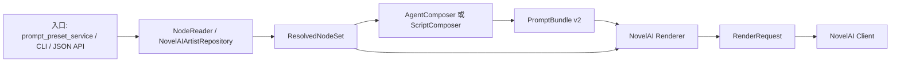

# Artist Node 与 PromptBundle v2 开发文档

## 1. 背景

本轮是 breaking change。目标是把“画风”从旧的 `style_ref` 字符串概念合并进输入层的 `artist node`，让提示词生成、agent cache、renderer 都围绕节点对象工作。

这不是兼容旧 tags_machine 的还原改造，而是 core 新架构的主链路收口：

- core 主链路不再接收或输出 `style_ref` / `style_node` / `style_payload`。
- 用户入口继续使用 `artist` 这个业务词。
- 旧 `design/画风/<artist>/tags.txt` 不迁移，运行时由 repository 读取并归一化成 `NodeDocument(kind="artist")`。
- agent cache key 不使用 artist 字符串 ref，而使用 artist node 的内容 hash。
- NovelAI renderer 是业务层，负责消费 artist node 并组织 NovelAI 请求。

## 2. 当前范围

本阶段只处理 NovelAI 可用主链路：

- `prompt_preset_service.py run-prompt`
- `refactor_prompt_bridge.py`
- core CLI / JSON API 的 run-prompt、render-plan、agent compose 边界
- `GenerationService`
- `AgentComposer`
- `NovelAIRenderAdapter`
- 旧 `design/画风` 读取器

不做：

- SD/WebUI 正式接入
- 提示词库迁移
- 旧 formula/run_action 强制等价
- 为旧 `style_ref` 保留兼容别名

## 3. PromptBundle v2 完整结构

`PromptBundle` 是“提示词生成层 -> 生图业务层”的边界。它只表达完整 prompt、生成来源、节点引用、cache 信息，不携带 NovelAI 专属参数。

```json
{
  "schema": "tags-machine-core.prompt-bundle/v2",
  "prompt": {
    "positive": "akemi homura, bare soles, foot focus",
    "negative": "bad feet, extra toes"
  },
  "meta": {
    "composer_type": "agent",
    "composer_version": "v1",
    "composition": {
      "character_scope": "foot_detail",
      "included_character_sections": ["character", "feet"],
      "suppressed_character_sections": ["hair", "eyes", "upper_clothes"]
    },
    "nodes": [
      {
        "role": "character",
        "id": "homura",
        "kind": "character",
        "ref": "F:/my_project/new/tags_machine/design/角色/.../meta.yaml",
        "index": 0,
        "content_hash": "sha256:..."
      },
      {
        "role": "action",
        "id": "foot_closeup",
        "kind": "action",
        "ref": "F:/my_project/new/tags_machine/design/动作/.../meta.yaml",
        "index": 0,
        "content_hash": "sha256:..."
      },
      {
        "role": "artist",
        "id": "20260412",
        "kind": "artist",
        "ref": "20260412",
        "index": 0,
        "content_hash": "sha256:..."
      }
    ],
    "agent": {
      "task_schema": "tags-machine-core.agent-composition-task/v2",
      "agent_model": null,
      "instructions": [],
      "notes": [],
      "extra": {}
    },
    "extra": {
      "character_materials": []
    }
  },
  "cache": {
    "cacheable": true,
    "cache_key": "sha256:...",
    "cache_hit": false
  },
  "created_at": "2026-06-01T00:00:00+00:00"
}
```

字段约束：

- `meta.nodes` 是唯一节点引用入口，支持多角色、多节点扩展。
- `role` 是输入角色，例如 `artist`、`character`、`action`、`background`。
- `kind` 是节点文档类型，artist 画风节点固定为 `artist`。
- `content_hash` 由节点内容生成，不包含本地 `path`。
- `meta.agent.instructions` 只记录外部 agent 任务输入，不是 renderer 参数。

## 4. Artist Node 规范

旧 `design/画风/<artist>/tags.txt` 运行时归一化为：

```yaml
schema: tags-machine.artist/v1
kind: artist
id: "20260412"
name: "20260412"
renderers:
  novelai:
    legacy_compat: true
    include_common_tags: false
    prompt_prefix: []
    prompt_suffix: []
    negative_prompt: []
    after_negative_prompt: []
    params: {}
    flags: []
legacy:
  source_file: ".../tags.txt"
```

旧 `tags.txt` 多行 prompt 的拆分规则：

- 第 1 行和第 2 行进入 `prompt_prefix`。
- 第 3 行及以后进入 `prompt_suffix`。
- `=` 后面的扩展字段进入 NovelAI renderer payload。
- `origin_uc` / `uc` 进入 `negative_prompt`。
- `after_uc` 进入 `after_negative_prompt`。
- `gen_json` 解析成 `params`。

这样等价于旧 formula 的简化模型：

```text
prompt_prefix = line A + line B
base_prompt = 完整角色动作 prompt
prompt_suffix = line C...
```

## 5. AgentComposer 规则

`AgentCompositionTask` 使用 v2：

```json
{
  "schema": "tags-machine-core.agent-composition-task/v2",
  "composer_version": "v1",
  "nodes": {
    "character": {},
    "character_2": {},
    "action": {},
    "artist": {}
  },
  "extra_prompt": "",
  "negative": "",
  "character_scope": "foot_detail",
  "instructions": [],
  "agent_model": null,
  "cache_key": "sha256:..."
}
```

cache key 输入：

- `composer_version`
- 每个 node 的 `content_hash`
- `extra_prompt`
- `negative`
- `character_scope`
- `agent_model`

cache key 不包含：

- artist 字符串 ref
- agent instructions
- agent 输出 prompt
- NovelAI 参数
- 输出图片路径

完整 prompt 已经提供时：

- 认为这是 agent 已完成拼接的结果。
- 用当前节点输入生成 task/cache key。
- 把 prompt 写入 PromptBundle cache。
- 继续进入 renderer 和出图链路。

完整 prompt 未提供时：

- 只读 cache。
- 命中则继续出图。
- 未命中则返回 `requires_agent` 和 `AgentCompositionTask`。

## 6. Renderer 规则

Renderer 是业务层，不是底层 client。NovelAI renderer 负责：

- 从 `artist` 参数或 `ResolvedNodeSet.artists()` 读取 artist node。
- 合并 artist `prompt_prefix`、base prompt、`prompt_suffix`。
- 合并 artist negative、bundle negative、after negative。
- 合并 artist `params` 与调用参数。
- 对 NAI4+ 模型支持 `character_prompts: {"mode": "auto"}`。
- 从 `resolved_nodes.characters()` 中提取角色 tags，并把 base prompt 中匹配到的角色 tags 移入 `v4_prompt.caption.char_captions`。
- 多角色共享 tag 先给每个匹配角色生成 caption，再从 base prompt 移除，避免只有第一个角色拿到共享特征。

`RenderRequest` 输出结构：

```json
{
  "schema": "tags-machine-core.render-request/v1",
  "backend": "novelai",
  "prompt": "...",
  "negative_prompt": "...",
  "model": "nai-diffusion-4-5-full",
  "seed": 123,
  "size": {
    "width": 1024,
    "height": 1024
  },
  "params": {
    "prompt": "...",
    "negative_prompt": "...",
    "v4_prompt": {
      "caption": {
        "base_caption": "...",
        "char_captions": []
      }
    },
    "v4_negative_prompt": {
      "caption": {
        "base_caption": "...",
        "char_captions": []
      }
    }
  },
  "artist_payload": {},
  "meta": {
    "action": "generate",
    "composer_type": "agent",
    "composer_version": "v1",
    "character_scope": null,
    "prompt_cache_key": "sha256:...",
    "node_refs": [],
    "character_prompts": {}
  }
}
```

## 7. 模块关系



职责：

- `NodeReader`：读取结构化 `meta.yaml/node.yaml/tags.txt`。
- `NovelAIArtistRepository`：读取旧 `design/画风` 并转成 artist node。
- `ResolvedNodeSet`：承载多节点输入，包含多角色和 artist。
- `AgentComposer`：处理 agent prompt cache，不处理 NovelAI 参数。
- `ScriptComposer`：处理脚本拼接，当前优先级低。
- `NovelAIRenderAdapter`：消费 PromptBundle 与节点对象，输出 NovelAI RenderRequest。
- `NovelAIClient`：只负责 HTTP 请求和图片返回。

## 8. 已落地改动

- `PromptBundle` 升级为 v2，`meta.nodes` 替代旧固定 `*_ref` 字段。
- `AgentCompositionTask` 升级为 v2，移除独立画风字符串输入。
- `NodeKind` 支持 `artist`，不再使用 `style` 作为主链路节点类型。
- `NovelAIArtistRepository` 读取旧 `design/画风/<artist>/tags.txt`。
- `RenderRequest` 使用 `artist_payload`。
- core CLI 使用 `--artist` / `--artist-node`。
- 迁移命令改为 `migrate-artist-tags`。
- `configs/local.example.yaml` 删除默认画风字段，artist 由入口显式传入。
- `prompt_preset_service.py run-prompt` 默认走 NAI4.5 新链路，并启用 auto character prompts。

### 8.1 NovelAI 模型兼容策略

artist 输入层只负责读取节点，不负责判断 NovelAI 模型版本。旧 `design/画风/<artist>/tags.txt` 会被 `NovelAIArtistRepository` 转成 artist node，并把 prompt 段、negative prompt、`gen_json` 参数保存在节点 payload 中。

NovelAI 相关兼容逻辑统一放在 `NovelAIRenderAdapter`：

- 如果调用参数或 artist payload 显式提供 `model`，优先使用显式模型。
- 如果入口启用旧 `run-prompt` 对比模式，bridge 只传内部标记 `_legacy_run_prompt_compat`，renderer 解析为 `nai-diffusion-3`。
- 如果 artist 是旧 `legacy_compat` 节点，且没有 `gen_json` / params，renderer 自动按 NAI3 artist 处理，使用 `nai-diffusion-3`。
- `_legacy_run_prompt_compat` 是 renderer 内部提示，不写入 NovelAI API 请求参数。
- NAI4.5 artist 保持默认 `nai-diffusion-4-5-full`，并继续支持 reference/vibe 与 `char_captions`。
- artist node 的 NovelAI payload 保留 `artist_ref` 和 `path`，用于 renderer 内部做旧画风兼容判断，不作为公共输入参数暴露。
- 旧 `动画_电影感` 清理逻辑按逗号分隔的 tag 单元删除命中项，避免把 `artist:morikura_en` 清成残留的 `artist:`。

已验证 `动画_电影感_改2` 属于旧 NAI3 artist：没有 `gen_json` 参数，不能强行套 NAI4.5 请求。修正后该 artist 自动走 `nai-diffusion-3`，真实 NovelAI 出图成功。

## 9. 验收计划

最小代码健康检查：

```powershell
python -m py_compile src\tags_machine_core\contracts.py src\tags_machine_core\cli.py src\tags_machine_core\renderers\novelai.py
```

主链路 dry-run 只用于确认结构，不作为最终验收：

```powershell
uv run python -m tags_machine_core run-prompt --prompt "akemi homura, foot focus" --artist 20260412 --config configs/local.example.yaml --dry-run --nt 1 --full
```

业务验收优先：

```powershell
uv run python prompt_preset_service.py run-prompt --prompt "akemi homura, foot focus" --artist 20260412 --character homura --nt 1 --seed 123
```

验收点：

- `PromptBundle.schema` 为 `tags-machine-core.prompt-bundle/v2`。
- `PromptBundle.meta.nodes` 包含 artist node。
- `AgentCompositionTask` 不包含旧画风字段。
- 更换 artist node 或修改 artist tags 会改变 agent cache key。
- `RenderRequest.artist_payload` 包含 NovelAI artist 参数。
- NAI4.5 模型下，多角色 tags 能进入 `char_captions`。
- 真实出图时 PNG 参数能读取，且 `request_body.parameters` 与图片参数一致。

## 10. 后续计划

下一步按优先级推进：

1. character prompts 匹配优化：当前按节点原始 tag 精确匹配，例如 `black_hair` 能移入 `char_captions`，但自然语言/空格写法 `black hair` 暂时不会匹配。后续需要增加 tag 归一化和 alias 匹配层，再进入“先匹配所有角色、再从 base prompt 移除”的流程。
2. 跑 `prompt_preset_service.py run-prompt` 单角色真实出图，确认 artist prompt、params、character prompts 生效。
3. 跑 homura + madoka 多角色真实出图，确认共享角色 tag 分配到多个 `char_captions`。
4. 用常用 artist 列表批量对比新 run-prompt 与旧 run-prompt，重点看 artist 支持和 PNG 参数。
5. 补一个轻量对比报告，输出图片路径、PNG 参数、request 参数、char_captions 摘要。
6. 再决定是否整理 SD/ComfyUI 的 artist 接口；当前不作为验收条件。