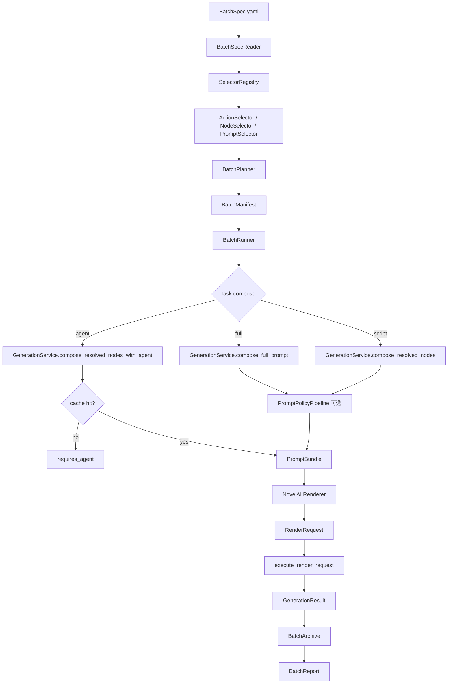

# 自动化批量跑图规格 v1

## 1. 背景

旧 `tags_machine` 里的 `blackboard.py` 承担了自动化批量跑图的核心职责：

- 从角色、动作、画风、背景等目录或列表中选择节点。
- 支持按分类文件夹批量选择动作，不需要逐个填写动作。
- 将角色、动作、画风等组合展开成多次生图任务。
- 支持 `n`、`nt`、`auto_num`、`use_num` 等批量数量控制。
- 维护输出目录、时间戳、运行参数和旧项目全局状态。
- 最终调用 `TagsMachine.run()`，由旧 `formula` 和 NovelAI 接入完成真实出图。

新 `tags_machine_core` 已经把提示词生成和生图执行拆成稳定边界：

```text
NodeDocument / full prompt
+ Composer
+ PromptPolicyPipeline
+ Renderer
+ Executor
= GenerationResult
+ PNG 参数证据
+ 图片文件
```

因此新批量跑图功能不应该复刻旧 `blackboard.py` 的全局状态和 hardcode，而应该新增一个批处理编排层。它只负责“选择、展开、调度、恢复、归档、报告”，不负责重新拼 prompt，也不直接拼 NovelAI payload。

## 2. 目标

第一版目标是做一个稳定、可恢复、可追踪的自动化跑图系统，功能类似旧 `blackboard.py`，但架构上服务未来前端 UI 和多后端扩展。

必须支持：

- 固定或批量选择 artist。
- 固定或批量选择 character。
- 按 action 文件夹、分类 collection、显式列表选择动作。
- 支持完整 prompt 列表，直接走 `run-prompt` 主链路。
- 支持 `agent` composer：cache hit 继续生图，cache miss 记录 `requires_agent`，不调用 NovelAI。
- 支持真实 NovelAI 批量出图。
- 支持 `resume`，已成功任务不重复跑。
- 支持 retry，尤其是 429、500、502、503、504、timeout。
- 支持每个任务归档 `PromptBundle`、`RenderRequest`、`GenerationResult`、PNG 参数和图片路径。
- 支持生成批量报告。

暂不作为第一版重点：

- 复刻旧 `formula/run_action` 的逐字效果。
- 接入 SD/WebUI。
- 接入 ComfyUI 真实跑图。
- 内置 agent 模型调用。
- 前端 UI。
- 自动视觉评分。
- 多线程/并发批量跑图。第一版默认串行，降低 NovelAI 限流风险。

## 3. 设计原则

1. 批量层只编排，不拼提示词规则。

   `BatchRunner` 不知道什么是脚部过滤、衣着过滤、character prompts。它只调用现有 `GenerationService`。

2. 选择器只负责选节点。

   action 分类文件夹、collection、glob、include/exclude 都属于选择输入，不进入 composer 或 renderer。

3. 真实出图优先。

   涉及生成链路的功能验收必须跑 NovelAI 真实出图，`nt=1` 起步，并保存图片路径和参数证据。

4. cache miss 是正常状态。

   agent 模式下没有 prompt cache 时，任务状态是 `requires_agent`，不是失败。

5. 所有任务都能恢复。

   每个任务有独立目录和状态文件。进程中断后可以从 manifest 恢复。

6. 后端参数不污染 PromptBundle。

   batch 配置可以传 render 参数，但这些参数只进入 renderer / RenderRequest，不写入 PromptBundle 的业务契约。

7. 对旧项目友好，但不依赖旧项目运行时代码。

   可以读取旧 `design` 路径和 `tags.txt` / `meta.yaml`，但不 import 旧 `blackboard.py`、`formula.py`、`TagsMachine`。

## 4. 总体架构



## 5. 新增组件

### 5.1 BatchSpec

`BatchSpec` 是批量任务的用户入口，建议支持 YAML 和 JSON。YAML 是主要人写格式，JSON 是未来 UI 或 API 格式。

职责：

- 描述本次批量跑图的名称、输出目录、默认参数。
- 描述如何选择 characters、actions、artists、prompts。
- 描述如何展开组合。
- 描述执行策略：resume、retry、limit、shuffle、seed。
- 描述归档策略和报告策略。

不负责：

- 保存运行状态。
- 保存每个任务结果。
- 直接承载 `PromptBundle` 或 `RenderRequest`。

### 5.2 BatchSpecReader

职责：

- 读取 YAML/JSON。
- 做基础 schema 校验。
- 将相对路径解析到 spec 文件所在目录或 workspace root。
- 注入 `configs/local.example.yaml` 中的 `legacy.design_root` 等默认路径。

输出：

```text
BatchSpec
```

### 5.3 SelectorRegistry

职责：

- 按 selector 类型分发到不同选择器。
- 支持后续扩展 selector，而不改 `BatchPlanner`。

第一版内置 selector：

- `explicit`
- `folder`
- `collection`
- `glob`
- `prompt_list`
- `prompt_file`

### 5.4 ActionSelector

动作选择器。它是新系统里替代旧 `blackboard.py` 分类文件夹能力的关键组件。

职责：

- 从 action 文件夹递归发现动作节点。
- 支持 `meta.yaml`、`node.yaml`、`tags.txt` 作为动作节点入口。
- 支持 include / exclude / limit / shuffle。
- 支持 collection 名称映射到多个旧动作分类文件夹。

不负责：

- 判断动作语义。
- 执行 PromptPolicyPipeline。
- 根据动作生成 prompt。

### 5.5 NodeSelector

通用节点选择器。第一版可以先覆盖 character、artist、background，后续可扩展到 reference、vibe、prop 等节点。

职责：

- 将显式路径、文件夹、collection 展开成 `NodeRef`。
- 调用 `NodeReader` 或 `NovelAIArtistRepository` 校验节点可读。

### 5.6 PromptSelector

完整 prompt 选择器。

职责：

- 从 YAML 列表读取 prompt。
- 从 txt/jsonl/csv 文件读取 prompt。
- 给每条 prompt 分配稳定 id。

适用场景：

- agent 已经离线拼好 prompt。
- 想直接复用 `run-prompt` 主链路。
- 不需要 character/action node。

### 5.7 BatchPlanner

职责：

- 将 `BatchSpec` 展开成 `BatchTask` 列表。
- 支持 `product`、`zip`、`prompt_list`、`manual` 等展开模式。
- 计算稳定 task id。
- 写出初始 `BatchManifest`。

不负责：

- 真实生图。
- 读取 agent cache。
- 保存图片。

### 5.8 BatchManifest

批量任务状态中心。建议使用 JSONL，便于追加、恢复和人工查看。

职责：

- 记录每个 task 的输入快照。
- 记录状态变更。
- 记录输出路径。
- 支持 resume。

状态：

```text
pending
requires_agent
ready
running
succeeded
failed
skipped
cancelled
```

### 5.9 BatchRunner

批量主控。

职责：

- 读取或创建 manifest。
- 按顺序执行 pending / failed 任务。
- 根据 resume 策略跳过 succeeded。
- 遇到 requires_agent 时保存 agent task。
- 捕获错误并更新状态。
- 控制 retry、limit、stop_on_error。

不负责：

- 自己拼 prompt。
- 自己拼 NovelAI 请求。

### 5.10 BatchExecutor

单任务执行器。

职责：

- 将 `BatchTask` 转成现有 `GenerationService` 调用。
- 根据 composer 类型选择链路：
  - `full`：完整 prompt。
  - `agent`：节点 + AgentComposer cache。
  - `script`：节点 + ScriptComposer，低优先级。
- 调用 renderer 构建 `RenderRequest`。
- 调用 `execute_render_request` 真实生图。

输出：

```text
BatchTaskResult
```

### 5.11 BatchArchive

归档器。

职责：

- 为每个 task 创建独立目录。
- 保存 `prompt_bundle.json`。
- 保存 `render_request.json`。
- 保存 `generation_result.json`。
- 保存 `png_params.json`。
- 保存 `status.json`。
- 保存 agent task。
- 记录图片路径。

### 5.12 BatchReport

报告生成器。

职责：

- 生成 `report.md` 和 `report.json`。
- 汇总成功、失败、requires_agent 数量。
- 列出图片路径。
- 列出最终 prompt 片段。
- 列出失败原因和 retry 记录。
- 给人工视觉检查预留字段。

## 6. BatchSpec v1 格式

### 6.1 完整示例

```yaml
schema: tags-machine-core.batch/v1
name: homura-foot-batch
description: Homura 脚部动作批量验证

config: configs/local.example.yaml
output_root: outputs/batches

defaults:
  backend: novelai
  composer: agent
  artist: 20260412
  nt: 1
  resolution: random_standard
  image_format: png
  prompt_policy_profile: off
  model: nai-diffusion-4-5-full
  add_male_caption: true

collections:
  actions:
    foot:
      - F:/my_project/new/tags_machine/design/动作改2/st_ft_j
      - F:/my_project/new/tags_machine/design/动作改2/st_ft_bare
      - F:/my_project/new/tags_machine/design/动作改2/st_ft_leg
    common:
      - F:/my_project/new/tags_machine/design/动作改2/st_comm
  characters:
    madoka_main:
      - F:/my_project/new/tags_machine/design/角色/danbooru_mahou_shoujo_madoka_magica/danbooru_akemi_homura_暁美ほむら_魔法少女
      - F:/my_project/new/tags_machine/design/角色/danbooru_mahou_shoujo_madoka_magica/danbooru_kaname_madoka_鹿目まどか_魔法少女

select:
  artists:
    - selector: explicit
      refs:
        - 20260412
  characters:
    - selector: collection
      name: madoka_main
  actions:
    - selector: collection
      name: foot
      recursive: true
      node_files:
        - meta.yaml
        - node.yaml
        - tags.txt
      exclude:
        names:
          - classify.yaml
        paths:
          - "**/_archive/**"
      shuffle: false
      limit: 20

expand:
  mode: product
  max_tasks: 40
  shuffle: false

run:
  resume: true
  stop_on_error: false
  retry:
    max_attempts: 60
    timeout_seconds: 1
    retry_on:
      - 429
      - 500
      - 502
      - 503
      - 504
      - timeout
    backoff_seconds:
      - 1
      - 2
      - 5
      - 10

archive:
  save_prompt_bundle: true
  save_render_request: true
  save_generation_result: true
  save_png_params: true
  copy_images: false

report:
  markdown: true
  json: true
  include_prompt_preview: true
  include_png_params_summary: true
  visual_check_template: true
```

### 6.2 最小完整 prompt 批量示例

```yaml
schema: tags-machine-core.batch/v1
name: prompt-list-smoke
config: configs/local.example.yaml
output_root: outputs/batches

defaults:
  composer: full
  artist: 20260412
  nt: 1
  resolution: square

select:
  prompts:
    - selector: prompt_list
      items:
        - id: foot_001
          prompt: "akemi_homura, 1girl, bare feet, foot focus, lower body"
        - id: standing_001
          prompt: "akemi_homura, 1girl, standing, looking at viewer"

expand:
  mode: prompt_list

run:
  resume: true
```

### 6.3 agent cache 预热示例

```yaml
schema: tags-machine-core.batch/v1
name: agent-cache-fill
config: configs/local.example.yaml
output_root: outputs/batches

defaults:
  composer: agent
  artist: 20260412
  nt: 1

select:
  characters:
    - selector: explicit
      refs:
        - F:/my_project/new/tags_machine/design/角色/.../homura
  actions:
    - selector: folder
      root: F:/my_project/new/tags_machine/design/动作改2/st_ft_bare
      recursive: true
      limit: 5

expand:
  mode: product

run:
  resume: true
  execute_requires_agent: false
```

如果 agent cache miss，该任务输出 `requires_agent`，并在 `agent_tasks/<task_id>.json` 里保存任务。外部 agent 生成 prompt 后，可以通过后续命令回填 cache 再 resume。

## 7. Selector 详细设计

### 7.1 explicit selector

```yaml
- selector: explicit
  refs:
    - 20260412
    - F:/path/to/node
```

适合少量精确选择。

### 7.2 folder selector

```yaml
- selector: folder
  root: F:/my_project/new/tags_machine/design/动作改2/st_ft_bare
  recursive: true
  node_files:
    - meta.yaml
    - node.yaml
    - tags.txt
  exclude:
    paths:
      - "**/_archive/**"
      - "**/disabled/**"
  limit: 20
  shuffle: true
```

规则：

- 如果某目录下存在 `meta.yaml`，优先将该目录作为一个 action node。
- 如果没有 `meta.yaml` 但有 `node.yaml`，使用 `node.yaml`。
- 如果没有结构化 YAML 但有 `tags.txt`，作为 legacy node。
- `classify.yaml` 不是 action node，只作为分类/打标资料，不直接进入 action refs。

### 7.3 collection selector

```yaml
- selector: collection
  name: foot
  recursive: true
  limit: 30
```

`collection` 只是多个 selector root 的别名，用来保留旧项目“分类文件夹”体验。

建议 collection 定义放在 batch spec 里，后续也可以移动到独立配置：

```yaml
collections:
  actions:
    foot:
      - F:/.../动作改2/st_ft_j
      - F:/.../动作改2/st_ft_bare
```

### 7.4 glob selector

```yaml
- selector: glob
  pattern: F:/my_project/new/tags_machine/design/动作改2/st_ft_*/**/meta.yaml
  limit: 50
```

适合临时高级过滤。

### 7.5 prompt_file selector

```yaml
- selector: prompt_file
  path: prompts/foot_cases.txt
  format: lines
```

支持格式：

- `lines`：每行一个 prompt。
- `jsonl`：每行 `{ "id": "...", "prompt": "..." }`。
- `json`：数组。
- `csv`：包含 `id,prompt,negative` 列。

## 8. 展开模式

### 8.1 product

角色、动作、画风做笛卡尔积。

```text
characters x actions x artists x backgrounds
```

适合旧 `blackboard.py` 风格批量跑图。

### 8.2 zip

按索引配对。

```text
characters[0] + actions[0]
characters[1] + actions[1]
```

适合人工整理的成对案例。

### 8.3 prompt_list

每条完整 prompt 生成一个 task。

适合当前稳定的 `run-prompt` 主链路。

### 8.4 manual

用户直接列 task。

```yaml
tasks:
  - id: homura_foot_001
    composer: agent
    character: F:/.../homura
    action: F:/.../foot_detail
    artist: 20260412
```

适合验收集。

## 9. BatchTask 数据结构

内部结构建议：

```json
{
  "schema": "tags-machine-core.batch-task/v1",
  "id": "sha256-or-readable-id",
  "index": 0,
  "composer": "full|agent|script",
  "nodes": [
    {
      "role": "character",
      "ref": "F:/path/to/character",
      "index": 0
    },
    {
      "role": "action",
      "ref": "F:/path/to/action",
      "index": 0
    },
    {
      "role": "artist",
      "ref": "20260412",
      "index": 0
    }
  ],
  "prompt": null,
  "negative": null,
  "render": {
    "backend": "novelai",
    "artist": "20260412",
    "nt": 1,
    "resolution": "square",
    "seed": 246814101,
    "image_format": "png",
    "params": {}
  },
  "policy": {
    "prompt_policy_profile": "balanced"
  },
  "output": {
    "task_dir": "outputs/batches/<run_id>/tasks/<task_id>"
  },
  "source": {
    "batch_spec": "batch.yaml",
    "selected_by": ["collection:foot"]
  }
}
```

`id` 生成规则：

- 第一版建议可读 id 优先：`<index>_<character_slug>_<action_slug>_<artist_slug>`。
- 同名冲突时追加短 hash。
- hash 输入包括 composer、节点 refs、prompt、negative、artist、render 参数、policy 参数。
- 输出目录不进入 hash，避免移动 batch 后 id 改变。

## 10. BatchManifest 格式

建议文件：

```text
outputs/batches/<run_id>/manifest.jsonl
```

每行一个任务状态快照：

```json
{
  "schema": "tags-machine-core.batch-manifest-entry/v1",
  "task_id": "0001_homura_foot_20260412",
  "status": "succeeded",
  "attempt": 1,
  "task_path": "tasks/0001_homura_foot_20260412/task.json",
  "status_path": "tasks/0001_homura_foot_20260412/status.json",
  "generation_result_path": "tasks/0001_homura_foot_20260412/generation_result.json",
  "image_paths": [
    "F:/.../image.png"
  ],
  "error": null,
  "updated_at": "2026-06-13T00:00:00+08:00"
}
```

为了简化恢复：

- `manifest.jsonl` 可以追加状态。
- `index.json` 保存每个 task 最新状态。
- task 自己的 `status.json` 是单任务权威状态。

## 11. 输出目录规范

```text
outputs/batches/<run_id>/
  batch.yaml
  manifest.jsonl
  index.json
  report.md
  report.json
  agent_tasks/
    <task_id>.json
  tasks/
    <task_id>/
      task.json
      status.json
      prompt_bundle.json
      render_request.json
      generation_result.json
      png_params.json
      images.json
```

图片是否复制进 task 目录由 `archive.copy_images` 控制：

- `false`：只记录图片原路径，避免重复占空间。
- `true`：复制图片到 `tasks/<task_id>/images/`，适合归档验收集。

第一版默认 `false`。

## 12. 执行链路

### 12.1 full composer

输入：

```text
prompt
negative
artist
render params
policy config
```

链路：

```text
GenerationService.compose_full_prompt()
-> PromptPolicyPipeline 可选
-> build_render_request()
-> execute_render_request()
```

### 12.2 agent composer

输入：

```text
character/action/background/artist nodes
extra_prompt
negative
agent_model
cache_dir
```

链路：

```text
GenerationService.compose_resolved_nodes_with_agent()
```

结果：

- cache hit：返回 `PromptBundle`，继续生图。
- cache miss：抛出或返回 `AgentCompositionRequired`，任务状态标记为 `requires_agent`。

重要规则：

- `requires_agent` 不算失败。
- batch 不调用外部 agent。
- 如果 spec/task 携带完整 prompt，可视为 agent 结果回填 cache 后继续生图。

### 12.3 script composer

第一版保留接口，但优先级低。

用途：

- 后续评估 action/character meta.yaml 通用拼接能力。
- 不作为 MVP 真实业务主链路。

## 13. Retry 与限流

第一版默认串行执行，避免 NovelAI 限流。

retry 配置：

```yaml
retry:
  max_attempts: 60
  timeout_seconds: 1
  retry_on:
    - 429
    - 500
    - 502
    - 503
    - 504
    - timeout
  backoff_seconds:
    - 1
    - 2
    - 5
    - 10
```

执行策略：

- 每次失败写入 `status.json` 和 manifest。
- 命中 retry 条件则等待后重试。
- 超出次数后标记 `failed`。
- 非 retry 错误直接 `failed`。
- `stop_on_error: true` 时遇到 failed 停止整批。

注意：

- 旧 `prompt_preset_service.py run-prompt` 里的 `timeout 1s retry 60` 语义可以迁移到 batch 层，但不应该写死在 NovelAI client。
- client 和 execution 层保留通用 timeout/retry 能力；batch 层负责业务级 retry 策略。

## 14. 分辨率与样本数

第一版支持：

```yaml
resolution: square | landscape | portrait | random_standard
```

对应旧逻辑：

```text
Resolution.NORMAL_SQUARE
Resolution.NORMAL_LANDSCAPE
Resolution.NORMAL_PORTRAIT
```

策略：

- `random_standard` 在每个 task 执行前随机三种标准尺寸。
- 随机结果写入 task render 参数和 `status.json`，resume 时复用原结果，避免重复执行时尺寸漂移。
- `nt > 1` 仍传给 `RenderRequest.params.n_samples`，由现有 execution 拆成多次 `n_samples=1` 请求。
- 如果用户担心 Anlas，batch spec 应支持 `max_images` 总量限制。

## 15. Agent cache 回填流程

第一阶段不实现内置 agent，只提供文件化协作流程。

流程：

1. `run-batch batch.yaml`
2. 部分任务进入 `requires_agent`
3. 生成：

```text
agent_tasks/<task_id>.json
```

4. 外部 agent 读取任务并生成 prompt。
5. 用户或脚本写入：

```text
agent_results/<task_id>.json
```

6. 再次执行：

```bash
uv run python -m tags_machine_core resume-batch outputs/batches/<run_id>
```

7. BatchRunner 回填 AgentComposer cache，再继续真实生图。

agent result 格式：

```json
{
  "schema": "tags-machine-core.agent-composition-result/v2",
  "task_id": "0001_homura_foot_20260412",
  "prompt": {
    "positive": "akemi_homura, 1girl, bare feet, foot focus",
    "negative": ""
  },
  "meta": {
    "agent_model": "codex",
    "notes": []
  }
}
```

## 16. CLI 设计

### 16.1 plan-batch

只展开任务，不调用 NovelAI。

```bash
uv run python -m tags_machine_core plan-batch batch.yaml --output outputs/batches
```

输出：

- run_id
- task count
- selector summary
- manifest path

### 16.2 run-batch

展开并执行。

```bash
uv run python -m tags_machine_core run-batch batch.yaml
```

常用参数：

```bash
--limit 10
--resume
--no-resume
--stop-on-error
--output-root outputs/batches
--log-level info
```

### 16.3 resume-batch

从已有 run 目录恢复。

```bash
uv run python -m tags_machine_core resume-batch outputs/batches/20260613_homura-foot-batch
```

### 16.4 inspect-batch

查看状态。

```bash
uv run python -m tags_machine_core inspect-batch outputs/batches/20260613_homura-foot-batch
```

输出：

```text
succeeded: 8
failed: 1
requires_agent: 3
pending: 0
```

## 17. JSON API 设计

现有 JSON API 已有 `BatchItemRequest` 和 `resolve_batch_item` 的雏形。批量系统应复用它，但补上批量级 API。

建议新增：

- `api-plan-batch`
- `api-run-batch`
- `api-resume-batch`
- `api-inspect-batch`

第一版可以只做 CLI，内部模型设计时保留 API 兼容。

未来 UI 只依赖这些 JSON API：

- 选择节点。
- 预览展开任务。
- 启动批量。
- 查看状态。
- 查看 report 和图片。
- 处理 `requires_agent`。

## 18. 与旧 blackboard.py 的映射

| 旧能力 | 新组件 |
| --- | --- |
| `CustomDirInput.input_by_select` | `SelectorRegistry` + `ActionSelector` + `NodeSelector` |
| `topic_type` / `action_type` | `collections.actions` |
| `artist_list` / `character_list` / `action_list` | `select.artists` / `select.characters` / `select.actions` |
| `action_path` / `character_path` | `folder selector` |
| `tasks_func` | `BatchPlanner` + `BatchRunner` |
| `auto_num` | `expand.max_tasks` 或 `run.max_images` |
| `use_num` | `expand.count_from` 后续扩展 |
| `run_ts` | `run_id` |
| `n` / `nt` | `max_tasks` / `nt` |
| `CONST_STATE` | 显式 batch 配置 |
| `del_node_types` | PromptPolicy / Composer 显式策略，不用全局变量 |
| `TagsMachine.run()` | `GenerationService` + `execute_render_request` |
| `formula` | Composer / PromptPolicyPipeline，不放进 batch |

## 19. 错误处理

错误分类：

```text
selector_error
compose_error
requires_agent
render_error
execute_error
png_info_error
archive_error
```

处理策略：

- selector 阶段失败：默认整批失败，因为任务无法展开。
- 单 task compose/render/execute 失败：记录 task failed，是否继续由 `stop_on_error` 决定。
- `requires_agent`：不是 failed。
- PNG 参数读取失败：任务可标记 `succeeded_with_warning` 或 `failed`，第一版建议 `failed`，因为业务验收需要 PNG 参数证据。

## 20. 日志

复用现有日志系统：

- 默认 `error`。
- 批量执行建议 `info`。
- 排查 selector 和 resume 用 `trace`。

关键日志：

- BatchSpec loaded
- selector expanded
- task planned
- task started
- task requires_agent
- task succeeded
- task failed
- retry scheduled
- report written

## 21. 验收标准

### 21.1 第一阶段功能验收

固定画风 `20260412`，真实 NovelAI 出图。

至少覆盖：

- `prompt_list` 模式 2 张。
- `folder selector` 选择 action 文件夹 3 张。
- `collection selector` 选择旧动作分类 3 张。
- `agent` 模式 cache miss，确认生成 `agent_tasks` 且不调用 NovelAI。
- `resume` 跳过已成功任务。
- 一次 429/502/timeout 可重试场景，可以通过人工中断或 mock client 辅助验证，但最终仍要跑真实图。

### 21.2 每个成功任务的验收

必须保存：

- `task.json`
- `status.json`
- `prompt_bundle.json`
- `render_request.json`
- `generation_result.json`
- `png_params.json`
- 图片路径

必须满足：

- PNG 参数能读取。
- `GenerationResult.request_body` 与 PNG 参数对比 `diff_count=0`，或差异写入报告。
- `report.md` 能直接看到图片路径和最终 prompt 摘要。

### 21.3 业务验收优先级

验收优先顺序：

1. 真实 NovelAI 出图。
2. 图片路径和 PNG 参数证据。
3. 批量 resume / retry 是否可用。
4. 单元测试和接口测试。

## 22. MVP 开发顺序

### 阶段 1：批量 spec 和 planner

- 新增 batch models。
- 新增 BatchSpecReader。
- 新增 ActionSelector 的 folder / explicit。
- 新增 BatchPlanner。
- 新增 `plan-batch` CLI。

验收：

- 能从 action 文件夹展开任务。
- 生成 manifest。

### 阶段 2：真实执行

- 新增 BatchRunner。
- 新增 BatchExecutor。
- 调用现有 GenerationService 和 execute_render_request。
- 新增 `run-batch` CLI。

验收：

- 固定 `20260412` 真实出 2-3 张图。
- 保存 GenerationResult 和 PNG 参数。

### 阶段 3：resume / archive / report

- 新增 BatchArchive。
- 新增 BatchReport。
- 新增 `resume-batch` / `inspect-batch`。

验收：

- 成功任务不会重复执行。
- report 能列出图片路径和失败任务。

### 阶段 4：collection selector

- 支持 spec 内 `collections.actions`。
- 支持旧分类文件夹映射。

验收：

- 用 `foot` collection 展开动作并真实出图。

### 阶段 5：agent cache 流程

- agent cache miss 生成 `agent_tasks`。
- 支持 agent result 回填。
- resume 后继续生图。

验收：

- cache miss 不调用 NovelAI。
- 回填 prompt 后 resume 能真实出图。

## 23. 待确认问题

1. 第一版 collection 定义放在每个 batch spec 内，还是放在 `configs/action_collections.yaml` 里？

   建议：第一版两者都支持，但以 batch spec 内定义为主，便于任务自包含。

2. `classify.yaml` 是否只作为筛选标签来源？

   建议：第一版不读取 classify 规则，只跳过它。后续可以作为 selector filter 的输入。

3. 任务图片是否默认复制到 task 目录？

   建议：默认不复制，只记录路径。验收集需要归档时再开启 `archive.copy_images: true`。

4. 第一版是否需要并发？

   建议：不要。NovelAI 限流和 Anlas 成本更重要，先串行稳定。

5. BatchRunner 是否接入父项目 `prompt_preset_service.py`？

   建议：第一版只在 `refactor` 内开发 CLI。父项目后续可加很薄的桥接命令。

## 24. 推荐结论

第一版自动化跑图应实现为 `tags_machine_core.batch` 包，提供：

- `BatchSpec`
- `ActionSelector`
- `BatchPlanner`
- `BatchRunner`
- `BatchArchive`
- `BatchReport`
- CLI：`plan-batch`、`run-batch`、`resume-batch`、`inspect-batch`

它复用现有：

- `GenerationService`
- `AgentComposer`
- `PromptPolicyPipeline`
- `NovelAIRenderer`
- `execute_render_request`

这样既能恢复旧 `blackboard.py` 的“按分类批量跑图”体验，又不会把旧全局状态和 formula hardcode 带进新架构。
