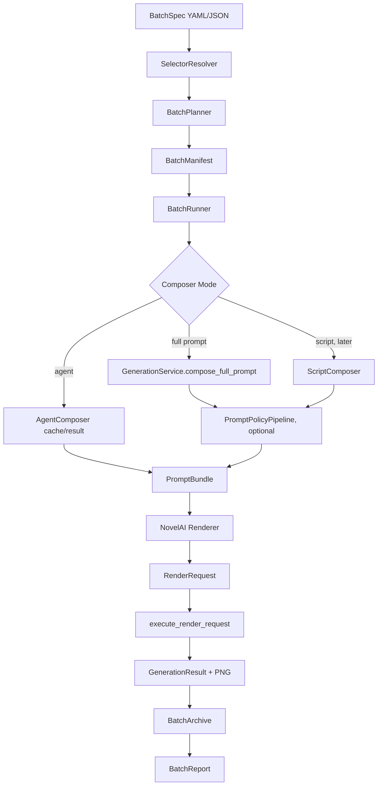

# 自动化批量跑图设计规格 v1

## 1. 背景

旧 `tags_machine` 里的 `blackboard.py` 承担了自动化批量跑图职责：按画风、人物、动作、背景等输入集合展开任务，然后循环调用旧 `TagsMachine.run()` 生成图片。这个能力很实用，尤其是旧项目支持按“动作分类文件夹”批量跑，不需要手动逐个填写 action。

`tags_machine_core` 的目标不是复制旧 `blackboard.py` 的全局状态和 formula 耦合，而是在新架构里补一个独立的批量编排层。批量编排层只负责“选什么、跑多少、怎么恢复、怎么归档、怎么报告”，不负责拼提示词，也不直接拼 NovelAI payload。

## 2. 目标

第一版目标是做一个类似旧 `blackboard.py` 的自动化跑图能力，但保持 core 架构边界清晰：

- 支持按动作分类文件夹批量选择 action，不要求用户一个个填写动作。
- 支持 character、action、artist、prompt 列表展开成批量任务。
- 默认以 `AgentComposer` 和完整 prompt `run-prompt` 链路为主。
- 支持 agent cache miss：不调用 NovelAI，输出 agent task，等待外部 agent 回填 prompt。
- 支持真实 NovelAI 出图、失败重试、断点恢复、任务状态记录。
- 每个任务保存 `PromptBundle`、`RenderRequest`、`GenerationResult`、PNG 参数和图片路径。
- 自动生成批量报告，方便人工做视觉验收。
- 验收优先使用真实业务出图，不把 dry-run 或单元测试作为主要完成标准。

## 3. 非目标

第一版不做这些事情：

- 不迁移旧提示词库。继续通过 `configs/local.example.yaml` 里的 `legacy.design_root` 读取旧 `design`。
- 不复刻旧 `formula` 的 hardcode 拼接规则。
- 不把动作分类、collection、筛选逻辑写进 Composer 或 Renderer。
- 不接入 SD/WebUI。当前真实执行目标只做 NovelAI。
- 不做完整前端 UI，只保留未来 UI 可复用的数据结构。
- 不自动评价图片好坏。视觉验收先由人工查看报告和图片。
- 不默认让 `AgentComposer` 经过 `PromptPolicyPipeline`，保持当前稳定链路。

## 4. 总体架构



核心边界：

- `BatchSpec` 描述批量任务，不描述 NovelAI 原始 payload。
- `SelectorResolver` 负责把文件夹、collection、glob 展开成节点引用。
- `BatchPlanner` 负责把输入集合展开成任务清单。
- `BatchRunner` 负责调度任务，不拼 prompt。
- `GenerationService`、`AgentComposer`、`PromptPolicyPipeline`、`NovelAI Renderer`、`execute_render_request` 全部复用现有能力。

## 5. 新增组件

### 5.1 BatchSpec

`BatchSpec` 是用户编写的批量跑图配置。支持 YAML 和 JSON，推荐 YAML。

职责：

- 定义批量任务名称、输出目录、配置文件。
- 定义默认 artist、composer、nt、分辨率、重试策略。
- 定义输入集合和展开方式。
- 定义 agent cache、prompt policy、输出归档策略。

不负责：

- 不保存实际生成结果。
- 不保存已展开后的所有任务状态。
- 不承载后端原始请求体。

### 5.2 SelectorResolver

把用户友好的选择方式解析成明确的 refs。

第一版 selector：

| selector | 用途 |
| --- | --- |
| `list` | 手动列出 refs |
| `folder` | 从一个文件夹扫描节点 |
| `collection` | 从命名集合读取一组文件夹或 refs |
| `glob` | 用 glob 表达式扫描节点 |
| `prompt_file` | 从文本或 JSONL 读取完整 prompt |

### 5.3 ActionSelector

`ActionSelector` 是 `SelectorResolver` 的 action 专用实现。它保留旧项目“填分类文件夹”的体验。

它支持：

- 扫描动作分类文件夹。
- 递归扫描子目录。
- 优先识别 `meta.yaml`。
- 兼容旧动作节点的 `tags.txt`。
- 可排除 `classify.yaml`，因为它是打标/分类辅助文件，不是直接动作节点。
- 支持 include、exclude、limit、shuffle、seed。

### 5.4 NodeSelector

统一处理 character、artist、background 等节点选择。第一版可以只实现 action 和 character 的必要路径，但数据结构按多节点扩展设计。

### 5.5 CollectionRegistry

管理常用集合，例如 `foot`、`common`、`sex`、`body`。集合只是一组 selector 的别名，不影响 Composer 和 Renderer。

可以放在：

```text
configs/batch_collections.yaml
```

也可以允许 `BatchSpec` 内联定义 `collections`。

### 5.6 BatchPlanner

把 `BatchSpec` 展开成 `BatchManifest`。

职责：

- 解析 selectors。
- 做 `product`、`zip`、`prompt_list`、`sample` 等展开。
- 分配 task id。
- 分配 seed。
- 计算输出目录。
- 生成待执行任务列表。

不负责：

- 不调用 NovelAI。
- 不调用外部 agent。
- 不修改 prompt cache。

### 5.7 BatchManifest

记录已展开任务和状态，是断点恢复的核心。

建议保存为：

```text
manifest.jsonl
index.json
```

`manifest.jsonl` 一行一个 task，便于追加和恢复；`index.json` 保存批次摘要。

### 5.8 BatchRunner

批量主控。

职责：

- 读取 `BatchManifest`。
- 按状态执行 `pending`、可重试的 `failed`。
- 跳过 `succeeded`。
- 遇到 `requires_agent` 时输出 agent task，不调用 NovelAI。
- 控制最大图片数、重试、暂停和恢复。

第一版建议串行执行。NovelAI 真实出图不急着并发，避免触发 429 和难以定位失败。

### 5.9 BatchExecutor

单任务执行器。

职责：

- 根据 task 调用 `GenerationService`。
- 生成或读取 `PromptBundle`。
- 生成 `RenderRequest`。
- 调用 `execute_render_request`。
- 返回标准化 `BatchTaskResult`。

不负责：

- 不扫描文件夹。
- 不管理全局批次状态。

### 5.10 BatchArchive

保存每个 task 的证据。

建议目录：

```text
outputs/batches/<run_id>/
  batch.yaml
  manifest.jsonl
  index.json
  report.md
  agent_tasks/
    <task_id>.json
  tasks/
    <task_id>/
      input.json
      prompt_bundle.json
      render_request.json
      generation_result.json
      png_params.json
      status.json
      images/
        xxx.png
```

### 5.11 BatchReport

生成批次报告。

报告内容：

- 批次名称、运行时间、配置摘要。
- 总任务数、成功数、失败数、requires_agent 数。
- 每个任务的图片路径、seed、artist、character、action、最终 prompt 摘要。
- 参数一致性检查结果。
- 待人工填写或后续补充的视觉结论字段。

### 5.12 Batch CLI

新增 CLI：

```bash
uv run python -m tags_machine_core run-batch batch.yaml
```

后续可加：

```bash
uv run python -m tags_machine_core plan-batch batch.yaml
uv run python -m tags_machine_core resume-batch outputs/batches/<run_id>
uv run python -m tags_machine_core inspect-batch outputs/batches/<run_id>
```

注意：`plan-batch` 只用于预览展开任务，不作为业务验收标准。业务验收仍然看真实 NovelAI 出图。

## 6. BatchSpec 结构

### 6.1 最小示例：完整 prompt 列表

```yaml
schema: tags-machine-core.batch/v1
name: prompt-list-smoke
config: configs/local.example.yaml
output_root: outputs/batches

defaults:
  backend: novelai
  composer: full
  artist: 20260412
  nt: 1
  resolution: random_standard
  image_format: png

expand:
  mode: prompt_list
  prompts:
    - "akemi_homura, 1girl, bare feet, foot focus, lower body"
    - "kaname_madoka, 1girl, standing, smile"

run:
  resume: true
  stop_on_error: false
  max_images: 10
```

### 6.2 按动作文件夹批量跑

```yaml
schema: tags-machine-core.batch/v1
name: homura-foot-folder
config: configs/local.example.yaml
output_root: outputs/batches

defaults:
  backend: novelai
  composer: agent
  artist: 20260412
  nt: 1
  resolution: random_standard
  image_format: png
  prompt_policy_profile: null

expand:
  mode: product
  characters:
    - selector: list
      refs:
        - F:/my_project/new/tags_machine/design/角色/danbooru_mahou_shoujo_madoka_magica/danbooru_akemi_homura_暁美ほむら_魔法少女
  actions:
    - selector: folder
      root: F:/my_project/new/tags_machine/design/动作改2/st_ft_bare
      recursive: true
      prefer: meta.yaml
      include:
        - meta.yaml
        - tags.txt
      exclude:
        - classify.yaml
      shuffle: true
      seed: 24680001
      limit: 20
  artists:
    - selector: list
      refs:
        - 20260412

agent:
  cache_dir: cache/prompt
  model: default-agent
  on_cache_miss: record_task

run:
  resume: true
  stop_on_error: false
  retry:
    max_attempts: 60
    retry_on:
      - 429
      - 500
      - 502
      - 503
      - 504
      - timeout
    backoff_seconds:
      - 1
      - 2
      - 5
      - 10
```

### 6.3 使用 collection

```yaml
schema: tags-machine-core.batch/v1
name: homura-foot-collection
config: configs/local.example.yaml
output_root: outputs/batches

collections:
  actions:
    foot:
      - selector: folder
        root: F:/my_project/new/tags_machine/design/动作改2/st_ft_j
        recursive: true
      - selector: folder
        root: F:/my_project/new/tags_machine/design/动作改2/st_ft_bare
        recursive: true
      - selector: folder
        root: F:/my_project/new/tags_machine/design/动作改2/st_ft_leg
        recursive: true

defaults:
  backend: novelai
  composer: agent
  artist: 20260412
  nt: 1
  resolution: normal_square

expand:
  mode: product
  characters:
    - selector: list
      refs:
        - homura
  actions:
    - selector: collection
      name: foot
      limit: 30
      shuffle: true
```

### 6.4 zip 模式

用于人工配好的 case：

```yaml
expand:
  mode: zip
  characters:
    - selector: list
      refs: [homura, madoka]
  actions:
    - selector: list
      refs:
        - actions/foot_closeup/meta.yaml
        - actions/standing/meta.yaml
```

展开结果：

```text
homura + foot_closeup
madoka + standing
```

不是笛卡尔积。

## 7. selector 详细规则

### 7.1 folder selector

字段：

| 字段 | 类型 | 默认 | 说明 |
| --- | --- | --- | --- |
| `root` | string | 必填 | 扫描根目录 |
| `recursive` | bool | false | 是否递归 |
| `prefer` | string | `meta.yaml` | 同目录多个候选时优先文件 |
| `include` | list[string] | `["meta.yaml"]` | 可识别文件名 |
| `exclude` | list[string] | `[]` | 排除文件名或 glob |
| `limit` | int | null | 限制数量 |
| `shuffle` | bool | false | 是否打乱 |
| `seed` | int | null | shuffle seed |
| `sort` | string | `path` | 排序方式 |

默认行为：

- 优先返回 `meta.yaml`。
- 如果没有 `meta.yaml`，可以按 include 配置返回 `tags.txt`。
- `classify.yaml` 默认不作为 action 节点。
- 如果一个目录同时有 `meta.yaml` 和 `tags.txt`，只返回 `meta.yaml`。

### 7.2 collection selector

`collection` 是 selector 的别名集合。它只影响任务选择，不影响 prompt 拼接。

优先级：

1. `BatchSpec.collections`
2. `configs/batch_collections.yaml`
3. 未来 UI 或服务层注入的 collection registry

同名 collection 冲突时，BatchSpec 内联定义优先。

### 7.3 list selector

直接列 refs。适合小批量、验收 case、临时补充。

### 7.4 prompt_file selector

用于完整 prompt 批量跑图。

支持：

- `.txt`：一行一个 prompt，空行跳过。
- `.jsonl`：一行一个对象，可包含 `id`、`prompt`、`negative`、`seed`、`artist`。

## 8. 展开模式

### 8.1 product

笛卡尔积：

```text
characters x actions x artists x prompts
```

适合旧 `blackboard.py` 风格批量跑图。

### 8.2 zip

按索引配对。所有列表长度必须一致，或允许长度为 1 的列表广播。

适合人工设计验收集。

### 8.3 prompt_list

只展开 prompt，不要求 character/action 节点。默认走 `composer: full`。

### 8.4 sample

先按 product 展开，再随机抽样。用于大集合冒烟式业务测试，避免一次生成过多图片。

## 9. BatchTask

展开后的任务建议结构：

```json
{
  "schema": "tags-machine-core.batch-task/v1",
  "id": "task_000001",
  "status": "pending",
  "input": {
    "composer": "agent",
    "prompt": null,
    "negative": null,
    "nodes": [
      {
        "role": "character",
        "ref": "F:/.../homura"
      },
      {
        "role": "action",
        "ref": "F:/.../foot_detail/meta.yaml"
      },
      {
        "role": "artist",
        "ref": "20260412"
      }
    ]
  },
  "render": {
    "backend": "novelai",
    "artist": "20260412",
    "nt": 1,
    "resolution": "normal_square",
    "seed": 24680001,
    "image_format": "png"
  },
  "policy": {
    "prompt_policy_profile": null
  },
  "output": {
    "dir": "outputs/batches/20260612_homura-foot/tasks/task_000001"
  },
  "attempts": []
}
```

## 10. 任务状态

状态机：

```text
pending -> running -> succeeded
pending -> running -> failed
pending -> requires_agent
failed -> running -> succeeded
failed -> skipped
requires_agent -> pending
```

状态说明：

| 状态 | 说明 |
| --- | --- |
| `pending` | 已展开但未执行 |
| `running` | 当前执行中 |
| `requires_agent` | agent cache miss，需要外部 agent 拼 prompt |
| `succeeded` | 已真实出图成功 |
| `failed` | 执行失败，可根据 retry 策略重试 |
| `skipped` | 因限制、用户选择或不可恢复错误跳过 |

## 11. AgentComposer 工作流

`composer: agent` 时：

1. BatchTask 带完整 `prompt`：
   - 认为这是外部 agent 已拼好的结果。
   - 调用现有 AgentComposer 回填 cache。
   - 继续生成 `PromptBundle`、`RenderRequest` 并真实出图。

2. BatchTask 不带完整 `prompt`：
   - 根据 character/action/background/artist 节点查 AgentComposer cache。
   - cache hit：继续真实出图。
   - cache miss：写入 `agent_tasks/<task_id>.json`，任务状态为 `requires_agent`，不调用 NovelAI。

3. 外部 agent 回填后：
   - 更新对应 task 的 prompt 或 agent result。
   - 将状态从 `requires_agent` 改回 `pending`。
   - `resume-batch` 继续执行。

约束：

- Batch 不直接调用大模型 agent。
- Batch 不改变 AgentComposer cache key 规则。
- `PromptPolicyPipeline` 默认不处理 agent 输出，除非用户显式启用。

## 12. PromptPolicyPipeline 关系

BatchSpec 可以显式启用：

```yaml
defaults:
  prompt_policy_profile: balanced
```

规则：

- `composer: full` 时可以启用 PromptPolicyPipeline。
- `composer: script` 时可以启用 PromptPolicyPipeline。
- `composer: agent` 默认不启用，除非 BatchSpec 明确写：

```yaml
agent:
  apply_prompt_policy: true
```

第一版建议保持 `agent.apply_prompt_policy: false`，避免破坏已经稳定的 agent prompt cache 和真实出图效果。

## 13. 分辨率策略

支持三种标准尺寸：

| 名称 | 尺寸 |
| --- | --- |
| `normal_square` | `1024x1024` |
| `normal_landscape` | 标准横图 |
| `normal_portrait` | 标准竖图 |

`random_standard` 表示每个 task 从三种标准尺寸中随机选择。

随机策略：

- 如果 task 有固定 seed，则 resolution random 使用 task seed 派生，保证 resume 后一致。
- 如果没有 seed，则 BatchPlanner 分配 seed 后再决定分辨率。

## 14. NovelAI 执行策略

继续复用当前 execution 层：

- NovelAI `n_samples > 1` 会拆成多次 `n_samples=1` 请求。
- 每次请求独立保存图片。
- 每张图片写入 PNG info。
- `GenerationResult.request_body` 保留实际请求证据。

Batch 层补充：

- `nt` 表示这个 task 目标生成张数。
- 默认 `nt: 1`，避免不必要消耗。
- 批量多图通过多个 task 或 execution 拆分完成。

## 15. 重试策略

建议第一版支持：

```yaml
run:
  retry:
    max_attempts: 60
    retry_on: [429, 500, 502, 503, 504, timeout]
    backoff_seconds: [1, 2, 5, 10]
```

规则：

- 429、502、503、504、timeout 默认可重试。
- 参数校验失败、节点不存在、agent cache miss 不重试。
- 每次失败记录 attempt，包括时间、错误、是否会重试。
- 达到最大次数后标记 `failed`。

## 16. 输出和归档

每个 task 都应保存：

- `input.json`
- `prompt_bundle.json`
- `render_request.json`
- `generation_result.json`
- `png_params.json`
- `status.json`
- 图片文件

批次级保存：

- 原始 `batch.yaml`
- `manifest.jsonl`
- `index.json`
- `report.md`

`status.json` 示例：

```json
{
  "id": "task_000001",
  "status": "succeeded",
  "started_at": "2026-06-12T10:00:00+08:00",
  "finished_at": "2026-06-12T10:00:12+08:00",
  "image_paths": [
    "F:/.../task_000001/images/abc.png"
  ],
  "attempt_count": 1,
  "error": null
}
```

## 17. Report 格式

`report.md` 建议结构：

```markdown
# Batch Report: homura-foot-folder

## Summary

- total: 20
- succeeded: 18
- failed: 1
- requires_agent: 1

## Tasks

| id | status | artist | character | action | seed | image | note |
| --- | --- | --- | --- | --- | --- | --- | --- |
| task_000001 | succeeded | 20260412 | homura | foot_detail | 123 | images/abc.png | visual_result: pending |
```

每个 task 可追加：

```yaml
visual_result: pending | pass | fail | review
visual_note: ""
```

## 18. 错误处理

错误分类：

| 类型 | 行为 |
| --- | --- |
| selector 失败 | 批次规划失败，不进入执行 |
| 节点不存在 | task failed，不重试 |
| agent cache miss | task requires_agent，不重试 |
| NovelAI 429/502/timeout | 按 retry 策略重试 |
| NovelAI 参数非法 | task failed，不重试 |
| 图片保存失败 | task failed，可重试 |
| PNG 参数读取失败 | task failed 或 warning，按配置决定 |

## 19. CLI 设计

第一版 CLI：

```bash
uv run python -m tags_machine_core run-batch batch.yaml
```

参数：

| 参数 | 说明 |
| --- | --- |
| `--config` | 覆盖 BatchSpec 中的 config |
| `--output-root` | 覆盖输出根目录 |
| `--limit` | 限制本次最多执行多少 task |
| `--only-status` | 只执行指定状态，比如 failed |
| `--resume` | 开启恢复 |
| `--no-resume` | 忽略旧 manifest，重新规划 |
| `--log-level` | 日志级别 |

后续 CLI：

```bash
uv run python -m tags_machine_core plan-batch batch.yaml
uv run python -m tags_machine_core resume-batch outputs/batches/<run_id>
uv run python -m tags_machine_core inspect-batch outputs/batches/<run_id>
```

## 20. JSON API 关系

已有 JSON API 中的 `BatchItemRequest`、`BatchItemResult` 可以作为单任务契约基础，但当前只覆盖“单 item 解析”。新 BatchRunner 应该在它之上增加批次级对象：

- `BatchSpec`
- `BatchManifest`
- `BatchTask`
- `BatchRunResult`

未来 UI 可以直接消费这些对象：

- 展开预览：读取 `BatchManifest`。
- agent 待处理列表：读取 `requires_agent` tasks。
- 结果页：读取 `report.md` 和 `index.json`。
- 单图详情：读取 task 目录下的 `generation_result.json` 和 PNG。

## 21. 旧 blackboard 能力映射

| 旧能力 | 新设计 |
| --- | --- |
| `CustomDirInput.input_by_select` | `SelectorResolver` |
| `action_type/topic_type` 分类 | `CollectionRegistry` |
| 分类文件夹批量动作 | `ActionSelector(folder/collection)` |
| `tasks_func` 展开和循环 | `BatchPlanner + BatchRunner` |
| `TagsMachine.run` | `GenerationService + execute_render_request` |
| `run_ts/output_dir` | `BatchArchive` |
| `auto_num/use_num` | `expand.limit`、`run.max_images`、`sample` |
| `CONST_STATE` 全局状态 | 显式 BatchSpec 配置 |
| `del_node_types` | PromptPolicy/Composer 明确规则，不放全局变量 |

## 22. MVP 实施范围

第一版建议只做：

1. `BatchSpec` 数据模型。
2. `ActionSelector` 支持 `folder`、`collection`、`list`。
3. `BatchPlanner` 支持 `product`、`prompt_list`。
4. `BatchRunner` 串行执行。
5. `composer: full` 和 `composer: agent`。
6. NovelAI 真实出图。
7. `resume`、`retry`、`requires_agent`。
8. `BatchArchive` 保存完整证据。
9. `BatchReport` 生成 markdown。
10. CLI `run-batch`。

暂缓：

- 并发执行。
- Web UI。
- 图片自动评分。
- ScriptComposer 大规模扩展。
- ComfyUI / SD 真实批量执行。

## 23. 业务验收

验收不以 dry-run 为主。每个新增批量能力至少跑一组真实 NovelAI 出图。

### 23.1 基础验收

固定 artist：`20260412`

准备一个 batch：

- 1 个 character：Homura。
- 1 个 action folder：脚部相关小文件夹。
- limit：3 到 5。
- composer：agent。
- nt：1。

验收条件：

- 成功展开多个 action，不需要手动逐个列 action。
- cache miss 的任务标记为 `requires_agent`，没有调用 NovelAI。
- 回填 prompt 后，任务可 resume 并真实出图。
- 每个成功 task 都保存图片、`PromptBundle`、`RenderRequest`、`GenerationResult`、PNG 参数。
- PNG 参数和 `GenerationResult` 一致。
- `report.md` 能列出所有图片路径和任务状态。

### 23.2 完整 prompt 验收

准备一个 prompt list batch：

- 3 个完整 prompt。
- artist：`20260412`
- composer：full。
- prompt_policy_profile：balanced。
- nt：1。

验收条件：

- 3 张真实图片成功生成。
- PromptPolicy trace 写入 `PromptBundle.meta.extra`。
- 报告中能看到最终 prompt 摘要和图片路径。

### 23.3 恢复验收

手动中断或制造一个失败任务后重跑：

- 已成功任务不重复生成。
- 失败任务按 retry 策略重试。
- `requires_agent` 任务保持等待状态。

## 24. 风险和开放点

### 24.1 action 节点格式不统一

旧动作目录可能有 `tags.txt`、`meta.yaml`、`classify.yaml` 混用。第一版 selector 只负责发现候选，实际读取仍交给 NodeReader 或兼容读取器。遇到无法读取的节点，task failed 并记录路径。

### 24.2 agent cache miss 会中断真实出图

这是预期行为。Batch 不应该伪造 prompt，也不直接调用外部 agent。报告里需要清晰列出待 agent 处理任务。

### 24.3 批量过大导致成本和限流

第一版默认串行、`nt: 1`，并支持 `limit`、`max_images`、`sample`。用户明确扩大规模时再跑大量任务。

### 24.4 视觉验收仍需人工

BatchReport 先提供人工验收入口，不做自动判断。后续可以接入图像对比或人工标注文件。

## 25. 推荐开发顺序

1. 写 `BatchSpec` / `BatchTask` / `BatchManifest` 模型。
2. 实现 `ActionSelector` 的 folder/list/collection。
3. 实现 `BatchPlanner` 展开 product 和 prompt_list。
4. 实现 `BatchArchive` 和目录结构。
5. 实现 `BatchExecutor` 复用现有 `GenerationService`。
6. 实现 `BatchRunner` 串行执行、resume、retry。
7. 实现 `BatchReport`。
8. 加 `run-batch` CLI。
9. 用 `20260412` 跑真实 NovelAI 小批量验收。
