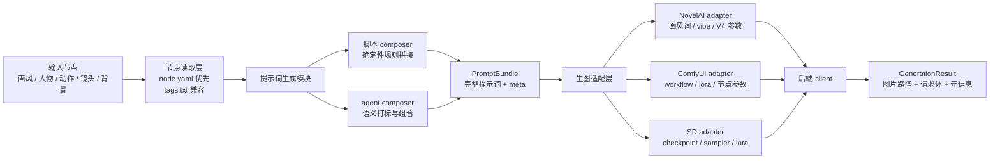

# Tags Machine Core 设计与开发方案 v1

`tags_machine_core` 是旧项目 `tags_machine` 的旁路新内核。它不承接旧项目里的历史耦合，而是重新定义清晰的数据契约、提示词生成流程和生图后端适配层。旧项目继续保持稳定，作为设计素材库和行为参考源存在。

## 背景问题

旧流程里，提示词生成、生图参数、画风节点、质量词、默认负面词、参考图和 NovelAI 细节都耦合在一起。这样短期能跑通批量出图，但会带来几个问题：

- 角色节点和动作节点直接拼接时容易语义冲突，比如脚底特写镜头仍把衣服、眼睛、头发等全身特征塞进画面。
- 画风、角色、动作、构图、镜头范围没有结构化边界，脚本和 agent 都只能读一坨文本。
- NovelAI、ComfyUI、SD 等后端的参数差异会反向污染提示词生成层。
- 旧项目被其他流程依赖，继续大改会增加回归风险。

新 core 的目标是把这些问题拆开：提示词层只负责“表达要画什么”，生图层负责“针对某个后端怎么画”。

## 项目边界

- 不在旧 `tags_machine` 里继续追加新架构代码。
- 不从 core import 旧项目的 `formula.py`、`tags_machine.py`、`blackboard.py`。
- 旧 `design/` 只作为数据源读取，通过配置里的 `legacy.design_root` 指向。
- 旧脚本可以作为验收 oracle，但不是运行时依赖。
- `参考项目/` 只作为本地技术参考，不进入当前仓库版本管理。

## 总体架构



核心原则：`PromptBundle` 是提示词生成层和生图层之间的分界线。它可以描述角色、动作、镜头、约束和缓存信息，但不直接携带某个后端专属的工作流细节。

## 模块通信格式

模块之间的主通信方式是运行时对象，不是文件。

文件只用于这些场景：

- 输入素材库：`meta.yaml`、`node.yaml`、`tags.txt`
- 缓存：把 `PromptBundle` 序列化成 JSON
- 队列：未来批量任务可以把请求序列化落盘
- 调试：保存 render plan、request body、结果日志
- 跨进程：CLI、前端、worker 之间需要恢复任务状态时使用 JSON

核心链路如下：

```text
YAML / tags.txt
-> NodeDocument
-> PromptBundle
-> RenderRequest
-> GenerationResult
```

### 输入层通信

输入层从文件读取节点：

- character：`meta.yaml`
- action：`meta.yaml`
- style / artist：暂时兼容 `tags.txt`，后续再定 YAML
- background：后续再定 YAML

读取后在运行时统一变成 `NodeDocument` 或更具体的 node DTO。composer 不直接操作文件路径里的文本，而是操作已经解析过的对象。

### Composer 输出

composer 输出 `PromptBundle`。

在同一个进程内，它就是普通内存对象：

```text
GenerationService.compose(...)
-> PromptBundle
```

需要缓存或跨进程时，才把它序列化成 JSON：

```text
cache/prompt/{cache_key}.json
```

所以 `PromptBundle` 不是“必须用文件通信”，而是一个稳定数据契约。文件只是它的持久化形式。

### Adapter 输出

adapter 接收 `PromptBundle`，输出 `RenderRequest`。

```text
NovelAIAdapter.build_request(prompt_bundle)
-> RenderRequest
```

`RenderRequest` 已经包含后端可执行参数，但还不负责网络请求。它也可以序列化成 JSON，用于：

- dry-run
- diff
- debug
- worker 队列
- 复现某次生成

### Client 输出

client 接收 `RenderRequest`，调用真实后端，输出 `GenerationResult`。

```text
NovelAIClient.generate(render_request)
-> GenerationResult
```

`GenerationResult` 记录图片路径、请求体摘要、图片参数、缓存命中等信息。它同样可以序列化成 JSON，方便 UI 和批量任务读取。

### 前端/服务通信

未来如果做前端 UI，推荐的 API 边界是 JSON：

```text
POST /compose
Node refs -> PromptBundle JSON

POST /render-plan
PromptBundle JSON -> RenderRequest JSON

POST /generate
RenderRequest JSON -> GenerationResult JSON
```

UI 不直接拼复杂 prompt，也不直接理解 NovelAI / ComfyUI 的底层参数。

## 数据契约

### PromptBundle

`PromptBundle` 是提示词生成模块的输出：

- `prompt.positive`：完整正向提示词。
- `prompt.negative`：基础负向提示词。
- `meta.character_ref`：人物节点引用。
- `meta.action_ref`：动作节点引用。
- `meta.style_ref`：画风节点引用。
- `meta.shot`：composer 输出的归一化镜头信息，例如 body_scope；action v1 输入侧先用更直接的 `character_scope`。
- `meta.constraints`：必须保留和必须避免的语义约束。
- `cache.cache_key`：用于 agent 拼接结果复用。

这一层不应该决定 NovelAI 的 `v4_prompt`、ComfyUI workflow、LoRA 权重等后端细节。

### RenderRequest

`RenderRequest` 是后端适配层的输出：

- `backend`：目标后端，例如 `novelai`、`comfyui`、`sd`。
- `prompt` / `negative_prompt`：后端最终接收的提示词。
- `model`：后端模型名。
- `size`：宽高。
- `params`：后端参数。
- `style_payload`：画风节点解析结果，方便调试和追溯。
- `meta`：action、composer 版本、cache key 等链路信息。

### GenerationResult

`GenerationResult` 是真实生图后的结果：

- `images`：本地图片路径、文件名和图片级 meta。
- `request_body`：发送给后端的请求体，默认展示时会截断图片 base64。
- `png_info`：后续用于保存和读取图片内嵌参数。
- `cache_hit`：是否命中缓存。

## 节点格式策略

短期兼容旧 `tags.txt`，长期迁移到结构化 YAML。

读取优先级：

1. `node.yaml`
2. `meta.yaml`
3. `tags.txt`

旧 `tags.txt` 的意义：

- 保持旧素材库可用。
- 给迁移脚本和结构化 YAML 提供原始来源。
- 不要求旧项目一次性改格式。

新 YAML 的方向：

- 人物节点只拆出角色素材事实，例如身份、头发、眼睛、服装、道具、身体局部等 section。
- 人物节点不写通用过滤规则，不写 `include_scopes` / `exclude_scopes`。
- 动作节点声明动作素材和 `character_scope`，例如 foot_detail、upper_body、full_body。
- composer 根据 action 的 `character_scope` 统一选择 character section。
- 画风节点要区分语义风格词、后端参数、参考图、负向词。
- 每个节点都应可被 agent 直接读取，并且能被脚本稳定解析。

## 提示词生成模块

### 脚本 composer

脚本 composer 负责确定性拼接，适合批量跑图和回归测试：

- 输入节点结构化字段。
- 根据动作节点的 `character_scope` 选择角色 section。
- 通用过滤策略放在 composer，不重复写进每个 character YAML。
- 输出稳定的 `PromptBundle`。

例子：脚底特写镜头中，composer 可以默认取 `character`、`copyright`、`body`、`feet`、`legwear`、`footwear`，并跳过 `eyes`、`hair`、`upper_clothes` 等 section。这个策略不写进角色节点。

### Agent composer

Agent composer 负责语义理解和复杂组合：

- 根据节点内容打标。
- 处理冲突，例如“脚底特写”和“全身服装展示”冲突。
- 生成完整动作角色混合提示词。
- 把结果和输入 hash 存入缓存，后续相同输入可以零 token 复用。

Agent 结果仍然要落到 `PromptBundle`，不能直接调用后端。

## 生图适配层

适配层负责把 `PromptBundle` 转成某个后端的 `RenderRequest`。

### NovelAI adapter

当前已完成第一版：

- 使用现代 `https://image.novelai.net/ai/generate-image` 接口结构。
- 支持 `nai-diffusion-4-5-full` 默认模型。
- 生成 `v4_prompt` 和 `v4_negative_prompt`。
- 兼容旧画风节点里的 `gen_json`。
- 保留 `reference_image_multiple`、`reference_strength_multiple` 等 vibe 字段。
- `ddim` 在新模型下转换为 `ddim_v3`。
- `k_euler_ancestral` 搭配非 native scheduler 时补 `deliberate_euler_ancestral_bug=false` 和 `prefer_brownian=true`。
- CLI 默认截断图片 base64，避免调试输出污染上下文。

### ComfyUI adapter

下一阶段设计：

- 根据 `style_ref` 选择工作流模板。
- 根据人物和画风节点注入 LoRA、embedding、control 参数。
- `PromptBundle` 不关心具体 ComfyUI 节点编号。
- adapter 产出完整 workflow JSON 或执行计划。

### SD adapter

下一阶段设计：

- 根据配置选择 checkpoint、vae、sampler、scheduler。
- 将结构化 LoRA 和 negative prompt 合成到 SD 请求体。
- 保持和 NovelAI/ComfyUI 一致的 `RenderRequest` 外壳。

## 当前 CLI

```powershell
uv run python -m tags_machine_core compose --prompt "akemi homura, foot focus"
uv run python -m tags_machine_core inspect-style --config configs\local.example.yaml --style-ref 20260412_2
uv run python -m tags_machine_core render-plan --config configs\local.example.yaml --prompt "akemi homura, foot focus" --seed 123
uv run python -m tags_machine_core generate --config configs\local.example.yaml --prompt "akemi homura, foot focus" --seed 123
```

说明：

- `render-plan` 只生成请求计划，不联网。
- `generate` 会调用 NovelAI，需要环境变量 `NAI_ACCESS_TOKEN`。
- 默认输出会截断 `reference_image_multiple`、`director_reference_images`、`image`、`mask`。
- 使用 `--full` 可以打印完整 JSON。

## 配置策略

`configs/local.example.yaml` 只保存示例和非敏感配置：

- `legacy.tags_machine_root`
- `legacy.design_root`
- `runtime.cache_dir`
- `runtime.output_dir`
- `defaults.backend`
- `defaults.style_ref`
- `novelai.base_url`
- `novelai.access_token_env`

真实 token 不写入配置文件，只从环境变量读取。

## 缓存策略

短期缓存对象：

- 输入节点引用。
- 输入节点内容 hash。
- composer 类型和版本。
- agent 模型版本。
- 输出的 `PromptBundle`。

缓存命中时可以绕过 agent 调用，降低 token 成本，并让批量跑图结果可复现。

## 迁移路线

第一阶段：旁路核心可用

- 保持旧项目稳定。
- 新 core 支持读取旧画风 `tags.txt`。
- 新 core 能生成 NovelAI render plan。
- 新 core 能用现代 NovelAI client 真实出图。

第二阶段：结构化节点

- 确认角色 `meta.yaml` 轻量事实库格式。
- 设计并落地 action / style / background 的结构化规范。
- 给动作、画风节点补结构化字段。
- 编写 `tags.txt -> node.yaml` 辅助迁移脚本。

第三阶段：composer 拆分

- 脚本 composer 支持角色 + 动作 + 镜头规则。
- Agent composer 支持语义组合和冲突修复。
- 引入 prompt cache。

第四阶段：多后端

- 增加 ComfyUI adapter/client。
- 增加 SD adapter/client。
- 统一生成结果和图片参数读取。

第五阶段：前端 UI

- 节点浏览和编辑。
- PromptBundle 预览。
- RenderRequest diff。
- 批量任务队列。
- 生成结果回看和参数复用。

## 验收标准

短期验收：

- `uv run python -m compileall -q src tests` 通过。
- `uv run python -m unittest discover -s tests` 通过。
- `render-plan` 输出包含完整 NovelAI V4/V4.5 字段。
- 默认 CLI 输出不会展开长 base64。
- core 不 import 旧项目运行时代码。

中期验收：

- 同一组输入在脚本 composer 下生成稳定 `PromptBundle`。
- Agent composer 的输出可缓存并复用。
- 局部镜头能通过 composer 策略正确选择角色 section。
- NovelAI、ComfyUI、SD 各自后端差异不会污染提示词生成层。

## 版本管理策略

`tags_machine_core` 使用独立 git 仓库管理：

- 主体代码、测试、文档、配置示例进入版本库。
- `.venv/`、`outputs/`、`cache/`、`.env`、`参考项目/` 不进入版本库。
- 每个阶段以清晰 commit 记录推进。
- 旧 `tags_machine` 的改动不和 core 混在同一个仓库里。
