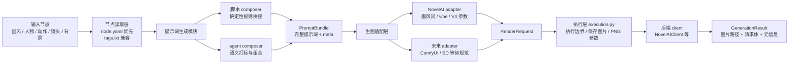

# Tags Machine Core 设计与开发方案 v1

`tags_machine_core` 是旧项目 `tags_machine` 的旁路新内核。它不承接旧项目里的历史耦合，而是重新定义清晰的数据契约、提示词生成流程和生图后端适配层。旧项目继续保持稳定，作为设计素材库和行为参考源存在。

## 背景问题

旧流程里，提示词生成、生图参数、画风节点、质量词、默认负面词、参考图和 NovelAI 细节都耦合在一起。这样短期能跑通批量出图，但会带来几个问题：

- 角色节点和动作节点直接拼接时容易语义冲突，比如脚底特写镜头仍把衣服、眼睛、头发等全身特征塞进画面。
- 画风、角色、动作、构图、镜头范围没有结构化边界，脚本和 agent 都只能读一坨文本。
- NovelAI、ComfyUI、SD 等后端的参数差异会反向污染提示词生成层。
- 旧项目被其他流程依赖，继续大改会增加回归风险。

新 core 的目标是把这些问题拆开：提示词层只负责“表达要画什么”，生图层负责“针对某个后端怎么画”。

## 项目边界

- 不在旧 `tags_machine` 里继续追加新架构代码。
- 不从 core import 旧项目的 `formula.py`、`tags_machine.py`、`blackboard.py`。
- 旧 `design/` 只作为数据源读取，通过配置里的 `legacy.design_root` 指向。
- 旧脚本可以作为验收 oracle，但不是运行时依赖。
- `参考项目/` 只作为本地技术参考，不进入当前仓库版本管理。

## 总体架构



核心原则：`PromptBundle` 是提示词生成层和生图层之间的分界线。它保存完整提示词、输入节点引用、composer 的关键选择结果和缓存信息，但不直接携带某个后端专属的工作流细节。

当前 v1 的确定接入和验收主线只包含 NovelAI。ComfyUI / SD WebUI / Forge 可以保留已提交的预研代码和 dry-run 能力，但不作为当前阶段的成功标准；后续等规范明确后再进入正式 adapter 验收。

## 模块通信格式

模块之间的主通信方式是运行时对象，不是文件。

文件只用于这些场景：

- 输入素材库：`meta.yaml`、`node.yaml`、`tags.txt`
- 缓存：把 `PromptBundle` 序列化成 JSON
- 队列：未来批量任务可以把请求序列化落盘
- 调试：保存 render plan、request body、结果日志
- 跨进程：CLI、前端、worker 之间需要恢复任务状态时使用 JSON

核心链路如下：

```text
YAML / tags.txt
-> NodeDocument
-> PromptBundle
-> RenderRequest
-> execution.py
-> GenerationResult
```

### 输入层通信

输入层从文件读取节点：

- character：`meta.yaml`
- action：`meta.yaml`
- style / artist：旧节点兼容 `tags.txt`，新节点使用 `node.yaml`
- background：`meta.yaml`

读取后在运行时统一变成 `NodeDocument` 或更具体的 node DTO。composer 不直接操作文件路径里的文本，而是操作已经解析过的对象。

### Composer 输出

composer 输出 `PromptBundle`。

在同一个进程内，它就是普通内存对象：

```text
GenerationService.compose(...)
-> PromptBundle
```

需要缓存或跨进程时，才把它序列化成 JSON：

```text
cache/prompt/{cache_key}.json
```

所以 `PromptBundle` 不是“必须用文件通信”，而是一个稳定数据契约。文件只是它的持久化形式。

### Adapter 输出

adapter 接收 `PromptBundle`，输出 `RenderRequest`。

```text
NovelAIAdapter.build_request(prompt_bundle)
-> RenderRequest
```

`RenderRequest` 已经包含后端可执行参数，但还不负责网络请求。它也可以序列化成 JSON，用于：

- dry-run
- diff
- debug
- worker 队列
- 复现某次生成

### Execution 输出

execution 层接收 `RenderRequest`，选择真实后端执行器，调用底层 client，保存图片并输出 `GenerationResult`。

```text
execute_render_request(config, render_request, ...)
-> execute_novelai_generation(...)
-> NovelAIClient.build_payload / generate_images
-> save_generated_images
-> collect_png_info
-> GenerationResult
```

当前正式执行边界在 `src/tags_machine_core/execution.py`。`run-prompt`、`generate`、`api-generate` 和 `execute-render-request` 都通过 `execute_render_request()` 做后端分发，默认只允许 NovelAI；NovelAI 路径再委托 `execute_novelai_generation()` 创建 `NovelAIClient`。`NovelAIClient` 只负责把 `RenderRequest` 转成 NovelAI 请求并调用服务，不负责 CLI 边界、归档、图片保存和 PNG 参数收集。

ComfyUI / SD 的真实执行函数也放在 execution 层，便于后续接入时复用同一边界；但它们仍属于预研能力，必须通过显式实验开关触发，不进入 v1 正式验收范围。

`GenerationResult` 记录图片路径、最终 request body、PNG 参数读取结果、缓存命中等信息。它同样可以序列化成 JSON，方便 UI、批量任务和验收资料包读取。

### 前端/服务通信

未来如果做前端 UI，推荐的 API 边界是 JSON。当前 v1 已先落地本地 JSON API 层 `GenerationJsonApi`，并提供 CLI 文件入口；详细请求、响应和状态分支契约集中维护在 `docs/json_api_contract_v1.md`，后续 HTTP 服务可以很薄地包在这些函数外面：

```text
POST /compose
Node refs -> PromptBundle JSON

POST /agent-task
Node refs -> AgentCompositionTask JSON

POST /render-plan
PromptBundle JSON -> RenderRequest JSON

POST /generate
RenderRequest JSON -> GenerationResult JSON
```

当前本地入口：

```powershell
uv run python -m tags_machine_core api-compose api_compose.json
uv run python -m tags_machine_core api-agent-task examples\requests\agent_resolution_requires_agent.json --output agent_task.json
uv run python -m tags_machine_core api-compose-agent examples\requests\agent_compose_with_result.json --output prompt_bundle.json
uv run python -m tags_machine_core api-resolve-agent examples\requests\agent_resolution_requires_agent.json --output agent_resolution.json
uv run python -m tags_machine_core api-render-plan api_render_plan.json
uv run python -m tags_machine_core api-compose-render-plan examples\requests\compose_render_plan_novelai.json --output api_response.json
uv run python -m tags_machine_core api-resolve-compose-render-plan examples\requests\agent_compose_render_plan_requires_agent.json --output api_resolution.json
uv run python -m tags_machine_core api-generate api_generate.json --config configs\local.example.yaml --output api_generate_response.json
```

`GenerationJsonApi.agent_task()`、`GenerationJsonApi.compose_agent()`、`GenerationJsonApi.resolve_agent()` 和 `GenerationJsonApi.resolve_compose_render_plan()` 是 agent 拼接的本地 JSON 边界。`agent_task()` 只生成稳定任务 JSON，不调用模型；`compose_agent()` 接收外部 agent result，落成 `PromptBundle` 并写入缓存，缓存缺失且没有 `agent.result` 时保持严格失败；`resolve_agent()` 面向前端和 worker，缓存命中或请求里带 `agent.result` 时返回 `status: "ready"` 和 `prompt_bundle`，缓存缺失时返回 `status: "requires_agent"` 和 `agent_task`，避免调用方靠异常解析流程状态。`resolve_compose_render_plan()` 进一步覆盖预览态：可生成计划时返回 `status: "ready"`、`prompt_bundle` 和 `render_request`，缺少 agent result 且缓存未命中时返回 `status: "requires_agent"` 和 `agent_task`。`api-compose` 在请求里带 `"composer": "agent"`、`agent.result` 或 `agent` 对象时，也会走同一条 agent composer 路径。`api-compose-render-plan` 的 `compose` 段也可以直接使用 agent 请求体和缓存配置，用于一步生成 agent `PromptBundle` 与对应的 `RenderRequest`。`compose-render-plan` 和状态分支响应已经用 Pydantic 响应模型约束，`ready` 与 `requires_agent` 分支互斥；未使用的顶层分支保持旧契约直接省略，而不是输出 `null`。

`examples/requests/` 保存可直接运行的 JSON 请求样例：`agent_resolution_requires_agent.json` 用于缓存缺失状态分支，`agent_compose_with_result.json` 用于 agent result 落成 `PromptBundle`，`compose_render_plan_novelai.json` 用于脚本 composer 到 NovelAI `RenderRequest`，`full_prompt_render_plan_novelai.json` 用于完整角色+动作 prompt 到 NovelAI `RenderRequest`，`agent_compose_render_plan_novelai.json` 用于 agent composer 一步生成 NovelAI render plan，`agent_compose_render_plan_requires_agent.json` 用于缺少 agent result 时的 render-plan 状态分支，`generate_novelai_mock.json` 用于无联网 mock executor 验证 `RenderRequest -> GenerationResult` 边界。测试会从仓库根目录读取这些文件，保证相对节点路径和 JSON 契约不漂移。

`examples/responses/json_api_response_shapes.json` 保存响应形状 golden，不锁完整响应快照，只约束前端/worker 需要依赖的 `schema`、`status`、关键节点引用、NovelAI `RenderRequest` 字段、V4 payload、`GenerationResult` 关键字段和缺失分支。测试会实际调用 `GenerationJsonApi` 校验这些形状。

`GenerationJsonApi.generate()` 只负责把 `RenderRequest` JSON 校验成稳定契约，再调用注入的 `generation_executor`，最后把 `GenerationResult` 校验并序列化返回。这样 HTTP 服务、worker 队列和本地 CLI 可以复用同一个 JSON 边界；真正联网生图仍由执行器决定。当前 `api-generate` CLI 注入的执行器复用 `execute_render_request()`，并关闭实验后端，只支持 NovelAI，符合 v1 正式范围。

UI 不直接拼复杂 prompt，也不直接理解 NovelAI / ComfyUI 的底层参数。

## 数据契约

### PromptBundle

`PromptBundle` 是提示词生成模块的输出：

- `prompt.positive`：完整正向提示词。
- `prompt.negative`：基础负向提示词。
- `meta.character_ref`：人物节点引用。
- `meta.action_ref`：动作节点引用。
- `meta.style_ref`：画风节点引用。
- `meta.composition.character_scope`：composer 实际采用的角色素材裁剪视角。通常来自 action 的 `character_scope`，也可能被显式参数或 agent 结果覆盖。
- `meta.composition.included_character_sections`：本次拼接纳入的 character section，便于调试和回放。
- `meta.composition.suppressed_character_sections`：本次拼接跳过的 character section，便于解释为什么没有带入头发、眼睛、上衣等素材。
- `cache.cache_key`：用于 agent 拼接结果复用。

这一层不应该决定 NovelAI 的 `v4_prompt`、ComfyUI workflow、LoRA 权重等后端细节。

`meta.shot` 不作为 v1 正式字段。原因是当前 action v1 已经用 `character_scope` 表达了“这个动作应该怎样裁剪角色素材”，如果再把同一信息复制成 `shot.body_scope`，会制造两套语义。未来只有在确实需要表达镜头语言，例如焦段、机位、构图，并且有明确消费方时，再单独引入 shot。

`meta.constraints` 也不作为 v1 正式字段。必须保留/必须避免这类约束目前没有稳定消费方，容易变成没人用的冗余字段。短期需要调试时可以放进 `meta.extra`，等脚本 composer、agent composer 或 UI 明确需要后再提升为正式契约。

### RenderRequest

`RenderRequest` 是后端适配层的输出：

- `backend`：目标后端，例如 `novelai`、`comfyui`、`sd`。
- `prompt` / `negative_prompt`：后端最终接收的提示词。
- `model`：后端模型名。
- `size`：宽高。
- `params`：后端参数。
- `style_payload`：画风节点解析结果，方便调试和追溯。
- `meta`：action、composer 版本、cache key 等链路信息。

### GenerationResult

`GenerationResult` 是真实生图后的结果：

- `images`：本地图片路径、文件名和图片级 meta。进入验收资料包时，图片路径必须改写为资料包内相对路径，避免回放依赖生成时的临时目录。
- `request_body`：发送给后端的请求体，默认展示时会截断图片 base64。
- `png_info`：生成后自动尝试读取保存图片里的 PNG 文本参数；如果图片不是 PNG 或没有可读参数，会保留读取错误，方便验收记录判断。
- `cache_hit`：是否命中缓存。

## 节点格式策略

短期兼容旧 `tags.txt`，长期迁移到结构化 YAML。

读取优先级：

1. `node.yaml`
2. `meta.yaml`
3. `tags.txt`

旧 `tags.txt` 的意义：

- 保持旧素材库可用。
- 给迁移脚本和结构化 YAML 提供原始来源。
- 不要求旧项目一次性改格式。

新 YAML 的方向：

- 人物节点只拆出角色素材事实，例如身份、头发、眼睛、服装、道具、身体局部等 section。
- 人物节点不写通用过滤规则，不写 `include_scopes` / `exclude_scopes`。
- 动作节点声明动作素材和 `character_scope`，例如 foot_detail、upper_body、full_body。
- composer 根据 action 的 `character_scope` 统一选择 character section。
- 画风节点要区分语义风格词、后端参数、参考图、负向词。
- 每个节点都应可被 agent 直接读取，并且能被脚本稳定解析。

## 提示词生成模块

### 脚本 composer

脚本 composer 负责确定性拼接，适合批量跑图和回归测试：

- 输入节点结构化字段。
- 根据动作节点的 `character_scope` 选择角色 section。
- 通用过滤策略放在 composer，不重复写进每个 character YAML。
- 输出稳定的 `PromptBundle`。

例子：脚底特写镜头中，composer 可以默认取 `character`、`copyright`、`body`、`feet`、`legwear`、`footwear`，并跳过 `eyes`、`hair`、`upper_clothes` 等 section。这个策略不写进角色节点。

### Agent composer

Agent composer 负责语义理解和复杂组合。当前 v1 采用“外部 agent + core 契约”的方式：core 不直接绑定某个 LLM SDK，而是生成稳定的 agent task JSON，接收 agent result JSON，再落成 `PromptBundle` 并写入缓存。

- 根据节点内容打标。
- 处理冲突，例如“脚底特写”和“全身服装展示”冲突。
- 生成完整动作角色混合提示词。
- 把结果和输入节点内容 hash 存入缓存，后续相同输入可以零 token 复用。

当前 CLI：

```powershell
uv run python -m tags_machine_core agent-task-nodes `
  --character examples\nodes\characters\homura `
  --action examples\nodes\actions\foot_closeup

uv run python -m tags_machine_core compose-agent-nodes `
  --character examples\nodes\characters\homura `
  --action examples\nodes\actions\foot_closeup `
  --agent-result agent_result.json `
  --cache-dir cache\prompt
```

`agent-task-nodes` 输出给 agent 读取的任务，不联网。`compose-agent-nodes` 接收外部 agent 结果并生成 `PromptBundle`；如果 `--cache-dir` 已有相同输入的缓存，可以不传 `--agent-result`，直接复用缓存。

面向前端和 worker 的等价文件入口是 `api-agent-task`、`api-compose-agent` 与 `api-resolve-agent`。它们读取同一类 JSON 请求，支持把 `agent.instructions`、`agent.result` 和 `cache.cache_dir` 放在请求体里，便于队列记录完整上下文：

```powershell
uv run python -m tags_machine_core api-agent-task examples\requests\agent_resolution_requires_agent.json `
  --output agent_task.json

uv run python -m tags_machine_core api-compose-agent examples\requests\agent_compose_with_result.json `
  --output prompt_bundle.json

uv run python -m tags_machine_core api-resolve-agent examples\requests\agent_resolution_requires_agent.json `
  --output agent_resolution.json

uv run python -m tags_machine_core api-resolve-compose-render-plan examples\requests\agent_compose_render_plan_requires_agent.json `
  --output api_resolution.json
```

`api-compose-agent` 是严格入口：缓存命中或带 `agent.result` 才能返回 `PromptBundle`。`api-resolve-agent` 是 agent prompt 状态入口：缓存命中或带 `agent.result` 时返回 `status: "ready"` 和 `prompt_bundle`；缓存缺失时返回 `status: "requires_agent"` 和 `agent_task`。`api-resolve-compose-render-plan` 是预览状态入口：可预览时返回 `status: "ready"`、`prompt_bundle` 和 `render_request`；需要外部 agent 时返回 `status: "requires_agent"` 和 `agent_task`。Agent 结果仍然要落到 `PromptBundle`，不能直接调用后端。

## 生图适配层

适配层负责把 `PromptBundle` 转成某个后端的 `RenderRequest`。

### NovelAI adapter

当前已完成第一版：

- 使用现代 `https://image.novelai.net/ai/generate-image` 接口结构。
- 支持 `nai-diffusion-4-5-full` 默认模型。
- 生成 `v4_prompt` 和 `v4_negative_prompt`。
- 兼容旧画风节点里的 `gen_json`。
- 保留 `reference_image_multiple`、`reference_strength_multiple` 等 vibe 字段。
- `ddim` 在新模型下转换为 `ddim_v3`。
- `k_euler_ancestral` 搭配非 native scheduler 时补 `deliberate_euler_ancestral_bug=false` 和 `prefer_brownian=true`。
- CLI 默认截断图片 base64，避免调试输出污染上下文。

### ComfyUI adapter（预研）

当前已有 adapter 和基础 client 第一版，但只作为预研和未来扩展保留，不进入本阶段验收主线：

- 根据 `style_ref` 选择工作流模板。
- 可从结构化 style node 的 `renderers.comfyui` 读取 workflow、workflow_path、workflow_json、checkpoint、LoRA、embedding、control、node_overrides 等后端配置。
- adapter 会把 `workflow_path` 指向的 JSON 展开到 `RenderRequest.params.workflow_json`，也支持直接内联 `workflow_json`。
- `PromptBundle` 不关心具体 ComfyUI 节点编号。
- adapter 产出统一 `RenderRequest` 执行计划，不负责联网。
- CLI 可通过 `render-plan --backend comfyui` 或 `render-plan-nodes --backend comfyui` 生成 dry-run 请求。
- `execute-render-request` 默认不执行 ComfyUI；只有显式传 `--allow-experimental-backend` 时，才会读取已有 `RenderRequest` 调用 ComfyUI `/prompt` 排队、轮询 `/history/{prompt_id}`、通过 `/view` 下载输出图片，并写入 `GenerationResult.images`。
- `GenerationResult.png_info.comfyui` 会记录 `prompt_id`、排队响应和 history；如果使用 `--comfyui-no-wait`，则只排队并返回 `prompt_id`。
- history 进入 `error` / `failed` 状态时，client 会抛出带 `prompt_id`、status、history 摘要的 `ComfyUIClientError`，避免把失败误判成“完成但无图”。

后续需要等 ComfyUI 规范明确后，再补齐更完整的节点级 patch、workflow 校准和正式验收样例。

### SD adapter（待规范）

当前已有基础 WebUI client 和 dry-run adapter 代码，但 SD WebUI / Forge 暂不接入，本阶段不继续推进：

- 根据配置选择 checkpoint、vae、sampler、scheduler。
- 可从结构化 style node 的 `renderers.sd` 读取 checkpoint、VAE、LoRA、embedding、ControlNet、hires_fix 等后端配置。
- 将完整 positive / negative prompt 合成到 SD 请求计划。
- 保持和 NovelAI/ComfyUI 一致的 `RenderRequest` 外壳。
- CLI 里的 SD 能力只作为预研入口保留，不作为 v1 验收通过条件；真实执行必须显式传 `--allow-experimental-backend`。

后续等 SD/WebUI 规范明确后，再决定字段契约、img2img、ControlNet、Forge 差异字段和验收样例。

## 当前 CLI

```powershell
uv run python -m tags_machine_core compose --prompt "akemi homura, foot focus"
uv run python -m tags_machine_core inspect-style --config configs\local.example.yaml --style-ref 20260412_2
uv run python -m tags_machine_core migrate-style-tags F:\my_project\new\tags_machine\design\画风\20260412_2 --output migrated\nodes\styles\20260412_2\node.yaml
uv run python -m tags_machine_core render-plan --config configs\local.example.yaml --prompt "akemi homura, foot focus" --seed 123
uv run python -m tags_machine_core render-plan-nodes --backend novelai --character examples\nodes\characters\homura --action examples\nodes\actions\foot_closeup --style-node examples\nodes\styles\anime_comfy --seed 123
uv run python -m tags_machine_core run-prompt --dry-run --prompt "akemi homura, bare soles, foot focus" --style-node examples\nodes\styles\anime_comfy --seed 123 --nt 3
uv run python -m tags_machine_core run-prompt --prompt-file agent_prompt.txt --style-ref 20260412_2 --config configs\local.example.yaml --output-dir outputs --seed 123 --nt 3
uv run python -m tags_machine_core api-compose-render-plan examples\requests\compose_render_plan_novelai.json --output api_response.json
uv run python -m tags_machine_core api-resolve-compose-render-plan examples\requests\agent_compose_render_plan_requires_agent.json --output api_resolution.json
uv run python -m tags_machine_core api-generate api_generate.json --config configs\local.example.yaml --output api_generate_response.json
uv run python -m tags_machine_core execute-render-request core_render_request.json --config configs\local.example.yaml --output-dir outputs
uv run python -m tags_machine_core create-acceptance-record --case-id foot_detail_homura_001 --legacy-source old.png --core-source core_render_request.json --prompt-bundle core_prompt_bundle.json --output acceptance\foot_detail_homura_001.yaml
uv run python -m tags_machine_core verify-acceptance-record acceptance\foot_detail_homura_001.yaml
uv run python -m tags_machine_core archive-acceptance-case --case-id foot_detail_homura_001 --output-dir acceptance --legacy-source old.png --core-source core_render_request.json --prompt-bundle core_prompt_bundle.json --required-case foot_detail
uv run python -m tags_machine_core archive-novelai-acceptance-nodes --case-id foot_detail_homura_001 --output-dir acceptance --legacy-source old.png --character examples\nodes\characters\homura --action examples\nodes\actions\foot_closeup --style-node examples\nodes\styles\anime_comfy --seed 123 --required-case foot_detail --overwrite
uv run python -m tags_machine_core archive-novelai-acceptance-prompt --case-id default_action_prompt_001 --output-dir acceptance --legacy-source old_request.json --prompt-file agent_prompt.txt --style-node examples\nodes\styles\anime_comfy --seed 123 --nt 3 --required-case default_action --overwrite
uv run python -m tags_machine_core verify-acceptance-suite acceptance --require-minimum-set
uv run python -m tags_machine_core verify-acceptance-suite examples\acceptance\suite.yaml --require-minimum-set
uv run python -m tags_machine_core generate --config configs\local.example.yaml --prompt "akemi homura, foot focus" --seed 123
```

说明：

- `render-plan` / `render-plan-nodes` 只生成请求计划，不联网；当前正式验收只要求 NovelAI 链路稳定。
- `run-prompt` 面向完整角色+动作混合 prompt。它不读取 character/action 节点，也不做 `character_scope` 裁剪，只把完整 prompt 落成 `PromptBundle`，再由 NovelAI adapter 叠加画风、quality、negative、V4 payload、reference/vibe 参数。`--dry-run` 输出 `PromptBundle + RenderRequest`，去掉 `--dry-run` 后需要 `NAI_ACCESS_TOKEN` 并真实生图；`--nt` 会写入 NovelAI `n_samples`，默认值保持旧接口习惯为 3。
- `api-compose` / `api-agent-task` / `api-compose-agent` / `api-resolve-agent` / `api-render-plan` / `api-compose-render-plan` / `api-resolve-compose-render-plan` / `api-generate` 是面向前端、worker 和队列的本地 JSON 边界，分别覆盖 `AgentCompositionTask`、agent 状态分支、`PromptBundle`、`RenderRequest` 和 `GenerationResult` 契约；请求样例在 `examples/requests/`，响应形状 golden 在 `examples/responses/json_api_response_shapes.json`。
- `generate` 是旧兼容快捷入口，当前只会调用 NovelAI，需要环境变量 `NAI_ACCESS_TOKEN`；新流程优先用 `run-prompt --dry-run` 预览，再真实执行。
- `api-generate` 和 `execute-render-request` 都读取已有 `RenderRequest` 后联网执行；默认只执行 NovelAI。ComfyUI / SD 真实执行必须显式传 `--allow-experimental-backend`，仍属于预研能力，不进入 v1 正式验收。
- `migrate-style-tags` 用于把旧画风 `tags.txt` 转成结构化 style `node.yaml`，默认不修改旧项目目录。
- `create-acceptance-record` / `verify-acceptance-record` 用于归档和重算单条旧项目对照验收记录；如果记录包含 `PromptBundle`，回放时会检查 `PromptBundle.meta` 没有重新引入 `shot` / `constraints`。
- `create-acceptance-record` 支持 `--whitelist` 记录字段兼容或归一化差异，也支持 `--intentional-difference` 记录 core 有意修复旧项目割裂问题导致的差异。
- 提供 `--generation-result` 时，验收记录会生成 `generation_result_evidence`，并检查 `GenerationResult.request_body` 与 core `RenderRequest` 归一化后一致，包括 reference/vibe 数组和 `director_reference_images`。
- `archive-acceptance-case` 会把旧项目 oracle 和 core 侧产物复制到独立样例目录，生成可回放 record，并更新 suite manifest。
- `archive-novelai-acceptance-nodes` 会从结构化节点生成 core 侧 `PromptBundle` 和 NovelAI `RenderRequest`，再归档旧项目 oracle；它不运行旧项目代码，也不联网生图。
- `archive-novelai-acceptance-prompt` 会从完整 prompt 生成 core 侧 `PromptBundle` 和 NovelAI `RenderRequest`，再归档旧项目 oracle；适合验证 agent prompt、人工完整 prompt 或旧 `run-prompt` 输出和旧 `run_action` 基准是否等价。
- `verify-acceptance-suite` 用于批量重算 record 目录或 manifest；`--require-minimum-set` 会检查 `default_action`、`foot_detail`、`hand_detail`、`complex_character`、`reference_style` 五类样例是否齐全，并输出 `case_checks` 验证关键样例语义：默认动作必须保留 NovelAI 核心默认参数和 V4 payload，局部镜头必须验证 character section 裁剪且最终 prompt 不能残留被抑制 section 的典型词，复杂角色必须验证默认 scope 不误过滤 hair / eyes / upper_clothes，参考图画风必须验证 reference 数组和 director reference 图语义。
- `examples/acceptance/` 是仓库内置的静态 dry-run 最小资料包，用于固定验收记录格式、参数归一化、PNG 参数读取、`GenerationResult` 图片证据和五类 minimum case 语义检查；它不等价于真实旧项目 oracle 验收。
- 默认输出会截断 `reference_image_multiple`、`director_reference_images`、`image`、`mask`。
- 使用 `--full` 可以打印完整 JSON。

## 配置策略

`configs/local.example.yaml` 只保存示例和非敏感配置：

- `legacy.tags_machine_root`
- `legacy.design_root`
- `runtime.cache_dir`
- `runtime.output_dir`
- `defaults.backend`
- `defaults.style_ref`
- `novelai.base_url`
- `novelai.access_token_env`
- `comfyui.base_url`（预研后端）
- `sd.base_url`（待规范后端）

真实 token 不写入配置文件，只从环境变量读取。

## 缓存策略

短期缓存对象：

- 输入节点引用。
- 输入节点内容 hash。
- composer 类型和版本。
- agent 模型版本。
- 输出的 `PromptBundle`。

缓存命中时可以绕过 agent 调用，降低 token 成本，并让批量跑图结果可复现。

## 迁移路线

第一阶段：旁路核心可用

- 保持旧项目稳定。
- 新 core 支持读取旧画风 `tags.txt`。
- 新 core 能生成 NovelAI render plan。
- 新 core 能通过 execution 层调用现代 NovelAI client 真实出图。

第二阶段：结构化节点

- 确认角色 `meta.yaml` 轻量事实库格式。
- 设计并落地 action / style / background 的结构化规范。
- 给动作、画风节点补结构化字段。
- 编写 `tags.txt -> node.yaml` 辅助迁移脚本。当前已支持旧画风 `tags.txt` 到 style `node.yaml` 的迁移，后续再扩展更多节点类型。

第三阶段：composer 拆分

- 脚本 composer 支持角色 + 动作 + 镜头规则。
- Agent composer 支持语义组合和冲突修复。
- 引入 prompt cache。

第四阶段：NovelAI 验收闭环

- 完成 NovelAI adapter / execution / client 的旧项目对照。
- 覆盖 reference image / vibe / V4 payload / 默认参数归一化。
- 统一生成结果和图片参数读取。

第五阶段：未来多后端

- ComfyUI adapter / execution / client 根据新规范进入正式验收。
- SD WebUI / Forge adapter / execution / client 根据新规范进入正式验收。

第六阶段：前端 UI

- 节点浏览和编辑。
- PromptBundle 预览。
- RenderRequest diff。
- 批量任务队列。
- 生成结果回看和参数复用。

## 验收标准

短期验收：

- `uv run python -m compileall -q src tests` 通过。
- `uv run python -m unittest discover -s tests` 通过。
- `render-plan` 输出包含完整 NovelAI V4/V4.5 字段。
- 默认 CLI 输出不会展开长 base64。
- `tests/test_project_boundaries.py` 会解析 `src/tags_machine_core` 和 `tests` 的 Python import，确保 core/test 不 import 旧项目运行时代码。

旧项目对照验收：

- 旧 `tags_machine` 作为行为 oracle，但不是运行时依赖；core 只读取素材文件和对照产物，不 import 旧项目的 `formula.py`、`tags_machine.py`、`blackboard.py`。这个边界由 `test_project_boundaries.py` 持续验证。
- 固定一组最小回归样例，至少覆盖：普通半身/全身动作、脚部局部特写、手部局部特写、角色服装复杂样例、带 `reference_image_multiple` 的画风样例。
- 每个样例使用同一组输入：character/action/style 引用、seed、尺寸、模型、sampler、steps、scale、negative prompt、参考图/vibe 参数。
- 旧项目用现有 `run_action` 或等价脚本生成基准图；core 用新链路生成对照图。两边生成参数需要从图片内嵌参数和请求体中读取，而不是只看 CLI 输出。
- 模块通信格式也必须参照旧项目验证：`PromptBundle` 要能解释旧 `run_action` 最终 prompt 的来源，`RenderRequest` 要能还原旧请求体的关键字段，`GenerationResult` 要能归档旧图和新图的内嵌参数差异。
- 参数对比要覆盖完整 NovelAI 请求关键字段，包括 `prompt`、`negative_prompt`、`model`、`width`、`height`、`scale`、`sampler`、`steps`、`seed`、`cfg_rescale`、`noise_schedule`、`v4_prompt`、`v4_negative_prompt`、`reference_image_multiple`、`reference_strength_multiple`、`reference_information_extracted_multiple`、`director_reference_images` 等。
- 对 base64 图片字段不做文本展开对比，但要比较数组长度、是否为空、图片 hash 或文件 hash、strength/information_extracted 等配套字段是否一一对应。
- 对旧项目和新 adapter 的字段命名差异允许做归一化，例如 `ddim` 到 `ddim_v3`、默认参数补齐、布尔默认值补齐；归一化规则必须写入测试或对照脚本，不能靠人工记忆。
- 如果两边图片像素不一致，优先检查请求体差异；若请求体完全一致但像素仍不同，需要记录后端非确定性、模型版本或 NovelAI 服务端策略变化，不把它当成 prompt composer 的失败。
- 局部镜头样例需要额外检查 `PromptBundle.meta.composition`：例如 `foot_detail` 必须包含脚部相关 section，并抑制 `hair`、`eyes`、`upper_clothes` 等不应进入脚底特写的角色 section。
- 新增 `run-prompt` / agent composer 入口时，必须能和旧 `run_action` 在同一基准样例上产出等价的 render plan；若 prompt 表达不完全相同，需要给出差异说明和可接受范围。

v1 冻结验收补充：

- `PromptBundle` 正式字段里不出现 `meta.shot` 和 `meta.constraints`。局部镜头、半身、全身等裁剪视角必须从 `meta.action_ref -> action.meta.yaml.character_scope -> meta.composition` 解释出来；验收资料包会用 `prompt_bundle_contract_evidence` 回放检查这一点。
- `meta.composition` 必须记录 composer 的实际选择，而不是重复 action 原始字段；验收时检查 `character_scope`、`included_character_sections`、`suppressed_character_sections` 是否和本次最终 prompt 一致。
- 如果 core 为了修复旧项目割裂问题而有意过滤某些旧 prompt 片段，例如 `foot_detail` 过滤 `hair`、`eyes`、`upper_clothes`，这类差异不能简单算失败，但必须写进验收记录的 `intentional_differences`，并说明来自哪条统一 composer 规则。
- 旧项目基准只负责提供 oracle：旧 `run_action` 的最终 prompt、请求体、PNG 内嵌参数和基准图。core 侧验收不得在测试或运行时 import 旧项目代码。
- `run-prompt`、脚本 composer、agent composer 三种入口只要目标是同一个样例，最终都必须能落到可比较的 `PromptBundle` 和 `RenderRequest`；验收通过线看归一化 diff，而不是看入口名称。
- 新增任何节点格式字段时，必须能回答它被哪个模块消费；没有消费方的字段先放入 `meta.extra` 或节点 `extra`，不得提升为 v1 契约字段。

模块通信格式的通过线：

- `PromptBundle` 验收：同一旧项目样例下，最终 positive / negative prompt 的关键 tag、质量词、默认 negative、角色/动作顺序和 `meta.composition` 裁剪结果必须可解释；允许 agent 改写连接方式，但必须保留旧项目关键 tag 或在记录里标成有意差异。
- `RenderRequest` 验收：由同一个 `PromptBundle` 生成的 NovelAI 请求，归一化后必须和旧项目请求体一致；ComfyUI / SD 暂不作为本阶段验收范围。
- `GenerationResult` 验收：真实生图后必须保存图片路径、请求体摘要、PNG 内嵌参数、参考图摘要和归一化 diff；验收记录会检查 `GenerationResult.images` 指向的图片文件是否存在，并记录大小和 sha256。图片像素只作为人工视觉抽检，不替代参数 diff。
- 缓存验收：agent composer 命中缓存时，除 `cache.cache_hit` 这类运行时命中标记外，重新输出的 `PromptBundle` payload 必须和首次生成结果字节级稳定；缓存 key 需要包含节点内容 hash、composer 版本和显式输入参数，避免旧素材更新后误用旧结果。
- 回放验收：任意一条验收记录都应该能在不运行旧项目代码的情况下重算 core 侧 diff；旧项目只负责提前产出 oracle 文件或基准图片。

旧项目对照的通过线：

- 每次新增 composer、adapter 或节点解析规则时，都至少选一个旧 `tags_machine` 可跑通的样例做回归对照。
- 对照流程分三步：旧项目生成基准请求/基准图，core 生成候选 `RenderRequest`/候选图，最后用归一化参数 diff 判断是否通过。
- 第一优先级是参数等价：归一化后 `prompt`、`negative_prompt`、模型参数、随机种子、参考图数组和 V4 payload 必须一致或有明确白名单差异。
- 第二优先级是节点裁剪等价：局部动作必须验证 character section 的纳入和抑制结果，不能只看最终字符串里有没有某几个词。
- 第三优先级才是图片视觉：图片可以作为人工抽检材料，但不能替代参数 diff；如果参数不同，先修参数，如果参数相同但像素不同，记录原因。
- 验收脚本不能依赖旧项目运行时代码。旧项目可以生成 oracle 文件，core 的测试只读取 oracle JSON、PNG 参数或素材文件。
- 通过记录需要保留最小证据：旧图路径、新图路径、旧请求参数、新 `RenderRequest`、归一化 diff 结果、是否存在白名单差异。
- 若归档真实生图结果，`GenerationResult.request_body` 必须能和 core `RenderRequest` 对齐；`GenerationResult.images` 中声明的图片也必须在资料包内可访问并能计算 hash。不一致或图片丢失时验收失败，避免图片证据和请求参数脱节。
- 回归样例集需要能用 `verify-acceptance-suite` 一次性回放；空目录、未批准差异、缺少必需样例都必须返回非 0。
- 使用 `--require-minimum-set` 时，suite 不只检查 case id：
  - `default_action` 必须验证 `prompt`、`negative_prompt`、`seed`、`width`、`height`、`sampler`、`steps`、`scale`、`cfg_rescale`、`noise_schedule`、`v4_prompt`、`v4_negative_prompt` 等 NovelAI 核心参数仍在。
  - `foot_detail` / `hand_detail` 必须验证 `PromptBundle.meta.composition` 的 scope、included sections 和 suppressed sections，并检查最终 prompt 没有残留被 suppressed sections 代表的典型角色片段。
  - `complex_character` 必须验证默认 scope 下 `hair`、`eyes`、`upper_clothes` 纳入角色组合，且没有被误放入 suppressed sections。
  - `reference_style` 必须验证 `reference_image_multiple`、`reference_strength_multiple`、`reference_information_extracted_multiple` 数组非空且长度一致，并验证 `director_reference_images` 非空。

变更门禁：

- 新增或修改 composer 时，至少选择一个旧 `run_action` 样例对照最终 positive / negative prompt、质量词、默认 negative、角色/动作拼接顺序和 `meta.composition`。局部镜头必须额外验证 section 纳入/抑制结果。
- 新增或修改 NovelAI adapter 时，必须和旧项目请求体做归一化 diff；参考图相关字段必须覆盖数组长度、图片摘要、strength、information_extracted，不能只比较 prompt 字符串。
- 新增 ComfyUI / SD adapter 能力前，必须先补对应规范；进入正式范围后，至少要证明同一个 `PromptBundle` 能生成完整 dry-run plan，并说明它和旧 NovelAI 请求字段的映射关系。
- 新增节点 YAML 字段时，必须能映射回旧素材或说明消费方；如果只是给未来使用，先放在 `extra`，不得进入 v1 必填契约。
- 新增 service / API / 前端通信格式时，必须用旧项目样例完成一次 JSON 往返：node refs -> `PromptBundle` -> `RenderRequest` -> `GenerationResult` / acceptance record。往返后关键字段不得丢失。

旧项目 oracle 资料包：

- 每个样例至少归档旧项目最终请求体、旧图、旧图 PNG 参数、新 `PromptBundle`、新 `RenderRequest`、新图或 dry-run 结果、验收记录。
- `archive-acceptance-case` 是 v1 默认的资料包生成入口；它只复制静态产物，不运行或 import 旧项目代码。归档 `GenerationResult` 时，它会把其中指向新图的路径改写为 `core/` 目录内的相对路径，让资料包离开源目录后仍可回放。
- 对结构化节点样例，优先使用 `archive-novelai-acceptance-nodes` 生成 core 侧 `PromptBundle` / `RenderRequest` 并归档，减少手工保存中间文件造成的漏项。
- 仓库内置 `examples/acceptance/` 只作为验收机制 fixture：它覆盖 `default_action`、`foot_detail`、`hand_detail`、`complex_character`、`reference_style` 五类 minimum case，并包含静态 PNG 参数证据，但其中 legacy 侧不是旧项目真实运行产物。
- oracle 资料包可以由旧项目脚本提前生成，但 core 的回放、测试和验收只能读取这些静态产物。
- 若旧项目自身输出存在已知问题，例如局部镜头混入头发、眼睛、上衣等不相关 tags，core 可以修复；修复差异必须进入 `intentional_differences`，并标明对应 composer 规则。
- 未归档 oracle 的新能力只能算开发完成，不能算旧项目对照验收完成。

旧项目基准验收矩阵：

| 层级 | 参照对象 | 必须一致的内容 | 允许差异 |
| --- | --- | --- | --- |
| 节点读取 | 旧 `design` / `character` / `action` 素材目录 | 同一个节点引用能解析到同一批核心 tags、negative tags、参考图配置 | 新 YAML 的字段名、分组名可以不同，但要能映射回旧素材含义 |
| 提示词生成 | 旧 `formula` / `run_action` 的最终 prompt 结果 | 正向 prompt、负向 prompt、质量词、默认负向词、角色/动作组合顺序 | agent composer 可以改写自然语言连接方式，但不能丢失旧项目关键 tag；差异必须写入对照记录 |
| 局部镜头裁剪 | 旧项目实际生成的局部动作样例 | `foot_detail`、`hand_detail` 等 scope 下应保留的角色部位 tags 与应过滤的 hair/eyes/upper_clothes 等 section | 如果旧项目本身存在割裂组合，新 core 可以修正，但要在验收记录里标记为“有意修复” |
| 生图参数 | 旧项目请求体和 PNG 内嵌参数 | seed、尺寸、模型、sampler、steps、scale、cfg_rescale、noise_schedule、V4 prompt、参考图数组、vibe 参数 | 字段命名和默认值补齐可以归一化；归一化规则必须进脚本 |
| 生成结果 | 旧项目基准图 | 参数一致时，新图应作为人工视觉抽检材料，确认主体、动作、镜头和画风没有明显偏离 | NovelAI 服务端非确定性、模型版本变动、相同参数下像素不一致，需要记录原因，不直接判 composer 失败 |

最小回归样例集：

- `default_action`：普通角色 + 普通动作，验证旧 `run_action` 的默认质量词、negative prompt、生成参数没有丢。
- `foot_detail`：脚部局部镜头，验证角色 section 裁剪，重点检查 hair / eyes / upper_clothes 不进入最终角色组合。
- `hand_detail`：手部局部镜头，验证与脚部类似但不复用错误的 feet tags。
- `complex_character`：服装、发型、眼睛、饰品较多的角色，验证默认 scope 下角色信息完整。
- `reference_style`：带 `reference_image_multiple` / vibe / style 参考图的画风样例，验证 base64 图片摘要、数组长度和 strength / information_extracted 一一对应。

每个回归样例都应产出一份可归档的验收记录：

```yaml
case_id: foot_detail_homura_001
legacy:
  image_path: F:/.../old.png
  params_path: F:/.../old_params.json
core:
  image_path: F:/.../core.png
  render_request_path: F:/.../core_render_request.json
image_evidence:
  legacy:
    exists: true
    bytes: 123456
    sha256: "..."
    png_info:
      parameters:
        seed: 123
  core:
    exists: true
    bytes: 123450
    sha256: "..."
    png_info:
      parameters:
        seed: 123
diff:
  normalized_equal: true
  whitelist:
    - path: $.parameters.sampler
      reason: adapter normalized sampler alias
  intentional_differences:
    - path: $.prompt.positive
      reason: foot_detail 按统一 composer 规则过滤 hair / eyes / upper_clothes
intentional_differences:
  - path: $.prompt.positive
    reason: foot_detail 按统一 composer 规则过滤 hair / eyes / upper_clothes
composition:
  character_scope: foot_detail
  included_character_sections: [character, copyright, body, feet, legwear, footwear]
  suppressed_character_sections: [hair, eyes, head_accessories, upper_clothes]
result: pass
```

验收记录可以通过目录或 manifest 批量回放：

```yaml
schema: tags-machine-core.acceptance-suite/v1
required_cases:
  - default_action
  - foot_detail
  - hand_detail
  - complex_character
  - reference_style
records:
  - default_action_001.yaml
  - foot_detail_homura_001.yaml
```

```powershell
uv run python -m tags_machine_core verify-acceptance-suite acceptance\suite.yaml
uv run python -m tags_machine_core verify-acceptance-suite acceptance --require-minimum-set
```

中期验收：

- 同一组输入在脚本 composer 下生成稳定 `PromptBundle`。
- Agent composer 的输出可缓存并复用。
- 局部镜头能通过 composer 策略正确选择角色 section。
- NovelAI 后端差异不会污染提示词生成层；未来 ComfyUI / SD 接入时也沿用同一边界。

## 版本管理策略

`tags_machine_core` 使用独立 git 仓库管理：

- 主体代码、测试、文档、配置示例进入版本库。
- `.venv/`、`outputs/`、`cache/`、`.env`、`参考项目/` 不进入版本库。
- 每个阶段以清晰 commit 记录推进。
- 旧 `tags_machine` 的改动不和 core 混在同一个仓库里。
