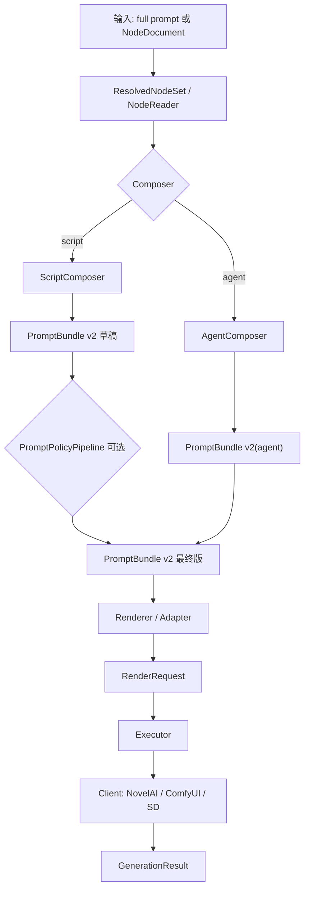

# refactor 当前架构设计 v2

## 1. 定位

`tags_machine_core` 是从旧 `tags_machine` 中拆出来的新核心项目。它的目标不是逐行复刻旧 `formula`，而是把“提示词生成”和“生图执行”解耦成稳定的数据契约：

- 输入层负责读取节点。
- Composer 负责生成完整提示词。
- PromptPolicyPipeline 负责可选的通用提示词规则治理。
- Renderer 负责把业务节点和 `PromptBundle` 转成后端请求。
- Executor / Client 负责真正联网生图。

当前真实主链路优先支持 NovelAI。ComfyUI / SD 目前保留 render-plan 和实验执行能力，不作为真实验收重点。

## 2. 总体链路



关键边界：

- `PromptBundle` 是提示词生成层和生图业务层之间的边界。
- `RenderRequest` 是生图业务层和后端执行层之间的边界。
- `GenerationResult` 是执行后的结果归档边界。
- `AgentComposer` 默认不经过 `PromptPolicyPipeline`，避免破坏已稳定的 agent prompt cache 和出图链路。

## 3. 输入层

主要代码：

- `src/tags_machine_core/nodes/models.py`
- `src/tags_machine_core/nodes/reader.py`
- `src/tags_machine_core/nodes/resolved.py`
- `src/tags_machine_core/nodes/novelai_artist.py`

核心对象：

```text
NodeDocument
ResolvedNode
ResolvedNodeSet
NovelAIArtistRepository
```

`NodeDocument` 是统一节点对象，当前常见 role 包括：

- `artist`
- `character`
- `action`
- `background`
- 未来可扩展 `vibe`、`reference`、`prop`、`camera`、`lighting`

`ResolvedNodeSet` 是一次任务中的节点集合。它保留 role、ref、index 和实际 `NodeDocument`，用于支持多角色、多节点和 renderer 读取上下文。

artist 已经并入输入层，不再把旧 `style_ref` 当作核心契约。旧 `design/画风/<artist>/tags.txt` 仍可通过 `NovelAIArtistRepository` 读取，并在运行时归一成 artist node。

## 4. 提示词生成层

主要代码：

- `src/tags_machine_core/composers/script.py`
- `src/tags_machine_core/composers/agent.py`
- `src/tags_machine_core/composers/cache.py`
- `src/tags_machine_core/services/generation_service.py`

### ScriptComposer

`ScriptComposer` 是规则化拼接入口。它只做通用节点拼接，不承载 NovelAI 专属参数，也不再优先复刻旧 formula 的所有 hardcode。

输入：

```text
character/action/background/artist NodeDocument
或 ResolvedNodeSet
extra_prompt
negative
character_scope/body_scope
```

输出：

```text
PromptBundle
```

### AgentComposer

`AgentComposer` 是当前优先稳定的主链路之一。它负责：

- 根据节点内容生成 agent task。
- 接收外部 agent 产出的完整 prompt。
- 写入或读取 `PromptBundle` cache。
- 产出 `composer_type = "agent"` 的 `PromptBundle`。

`AgentComposer` 不调用模型 SDK；外部 agent 如何拼 prompt 由调用方负责。

Agent cache key 当前由这些内容组成：

- composer version
- 节点内容 hash
- extra prompt
- negative
- character_scope
- agent_model

`instructions` 不进入 cache key，避免语气/偏好文字导致缓存过度分裂。

## 5. PromptBundle v2

主要代码：

- `src/tags_machine_core/contracts.py`

`PromptBundle` 是提示词层输出，不携带 NovelAI 专属字段。

结构摘要：

```json
{
  "schema": "tags-machine-core.prompt-bundle/v2",
  "prompt": {
    "positive": "完整正向提示词",
    "negative": "基础负向提示词"
  },
  "meta": {
    "composer_type": "script | agent | legacy",
    "composer_version": "v1",
    "composition": {
      "character_scope": "foot_detail",
      "included_character_sections": [],
      "suppressed_character_sections": []
    },
    "nodes": [
      {
        "role": "character",
        "id": "homura",
        "kind": "character",
        "ref": "节点来源",
        "index": 0,
        "content_hash": "sha256:..."
      }
    ],
    "agent": {
      "task_schema": "tags-machine-core.agent-composition-task/v2",
      "agent_model": null,
      "instructions": [],
      "notes": [],
      "extra": {}
    },
    "extra": {}
  },
  "cache": {
    "cacheable": true,
    "cache_key": "sha256:...",
    "cache_hit": false
  }
}
```

设计原则：

- 不再使用固定的 `character_ref/action_ref/style_ref` 顶层 meta 字段。
- 多角色、多节点统一进入 `meta.nodes`。
- 后端专属内容不写入 `PromptBundle`。
- policy trace 只写在 `meta.extra` 中，避免扩展正式字段造成契约震荡。

## 6. PromptPolicyPipeline

主要代码：

- `src/tags_machine_core/policies/config.py`
- `src/tags_machine_core/policies/tokens.py`
- `src/tags_machine_core/policies/context.py`
- `src/tags_machine_core/policies/pipeline.py`
- `src/tags_machine_core/policies/rules/`

`PromptPolicyPipeline` 位于 composer 之后、renderer 之前：

```text
ScriptComposer / full prompt
-> PromptBundle 草稿
-> PromptPolicyPipeline.apply()
-> PromptBundle 最终版
```

它负责可开关的通用提示词规则：

- `tag_normalize`：空格 tag 和下划线 tag 归一。
- `dedupe`：去重。
- `tag_conflict`：冲突 tag 清理，例如裸足和鞋袜冲突。
- `character_count`：补齐或前置 `1girl/2girls` 等人数 tag。
- `clothing_policy`：服装相关通用治理。
- `visibility_policy`：局部镜头中过滤眼睛、头发、上衣等不应出现的细节。

默认行为：

- `PromptPolicyConfig.enabled = false`
- 默认不影响任何已有链路。
- CLI 只有显式传 `--prompt-policy-profile` 或相关 rule 开关时才启用。
- `AgentComposer` 默认完全绕过该 pipeline。

## 7. Renderer / Adapter 层

主要代码：

- `src/tags_machine_core/renderers/novelai.py`
- `src/tags_machine_core/renderers/common.py`
- `src/tags_machine_core/renderers/comfyui.py`
- `src/tags_machine_core/renderers/sd.py`

Renderer 是生图业务层，不是底层 HTTP client。它负责把 `PromptBundle`、artist node、resolved nodes 和生成参数组织成后端请求。

NovelAI renderer 当前负责：

- artist prompt prefix/suffix 拼接。
- legacy artist tags.txt 兼容读取。
- NovelAI 参数默认值和合法性校验。
- gen_json / reference / vibe / director reference 等参数合并。
- NovelAI v4/v4.5 character prompts。
- 从 base prompt 中匹配 character node tags，并把角色提示词迁移到 `char_captions`。
- male character caption 的自动补充开关。

Renderer 可以包含 NovelAI 业务判断；真正与后端解耦的是 clients/request 执行层。

## 8. RenderRequest

主要代码：

- `src/tags_machine_core/contracts.py`

`RenderRequest` 是 renderer 输出给执行层的请求计划：

```json
{
  "schema": "tags-machine-core.render-request/v1",
  "backend": "novelai",
  "prompt": "最终送入后端的 prompt",
  "negative_prompt": "最终送入后端的 negative prompt",
  "model": "nai-diffusion-4-5-full",
  "seed": 123,
  "size": {
    "width": 1024,
    "height": 1024
  },
  "params": {},
  "artist_payload": {},
  "meta": {}
}
```

`RenderRequest.params` 可以包含后端强相关字段。此时已经离开提示词生成层，所以可以安全承载 NovelAI 专属 payload。

## 9. 执行层

主要代码：

- `src/tags_machine_core/execution.py`
- `src/tags_machine_core/clients/novelai.py`
- `src/tags_machine_core/clients/comfyui.py`
- `src/tags_machine_core/clients/sd.py`

执行层负责：

- 校验后端是否允许真实执行。
- 读取 token / base_url / timeout / retry。
- NovelAI `n_samples > 1` 时拆成多次单图请求。
- 保存图片。
- 写入 core PNG info。
- 返回 `GenerationResult`。

执行层不重新拼 prompt，也不读取业务节点。

## 10. CLI 与 JSON API

主要代码：

- `src/tags_machine_core/cli.py`
- `src/tags_machine_core/services/json_api.py`
- `src/tags_machine_core/services/json_api_models.py`

CLI 主要入口：

- `compose`
- `compose-nodes`
- `agent-task-nodes`
- `compose-agent-nodes`
- `render-plan`
- `render-plan-nodes`
- `run-prompt`
- `run-action`
- `api-*`

`run-prompt` 是当前稳定主链路：

- `--composer full`：调用方直接传完整 prompt。
- `--composer agent`：节点 + agent cache/result 进入 AgentComposer。
- artist 通过 `--artist` 或 `--artist-node` 输入。
- NovelAI 参数在 renderer 中处理。

JSON API 是本地服务契约，不绑定 HTTP 框架。未来前端可以直接复用 JSON API 的请求/响应结构。

## 11. 日志系统

主要代码：

- `src/tags_machine_core/logging_config.py`

日志级别：

- `trace`：最细链路和规则执行细节。
- `info`：业务阶段、composer/renderer/executor 边界。
- `warning`：非致命异常状态，例如 agent cache miss 后需要外部结果。
- `error`：错误级别，默认生产/非开发使用。

默认级别：

```text
error
```

开启方式：

```bash
uv run python -m tags_machine_core run-prompt --log-level trace ...
```

也可以用环境变量：

```bash
TAGS_MACHINE_CORE_LOG_LEVEL=trace
```

或在配置文件中写：

```yaml
logging:
  level: trace
```

CLI 参数优先级最高，其次是环境变量，再其次是配置文件，最终默认 `error`。

日志写入 stderr，不污染 stdout 的 JSON 输出。

## 12. AgentComposer 与 PromptPolicyPipeline 的确认方式

在 `--log-level trace` 下，agent 链路会出现类似日志：

```text
[INFO] tags_machine_core.services.generation_service: compose_resolved_nodes_with_agent started; PromptPolicyPipeline bypassed by design
[INFO] tags_machine_core.composers.agent: AgentComposer resolved task built ...
[INFO] tags_machine_core.composers.agent: AgentComposer composing PromptBundle from result ...
```

同时不应该出现：

```text
PromptPolicyPipeline applying
```

如果走 full prompt 或 script composer 并显式启用 policy，则会出现：

```text
[INFO] tags_machine_core.policies.pipeline: PromptPolicyPipeline applying target=full_prompt profile=balanced rules=[...]
```

这就是当前架构里确认“AgentComposer 没经过 PromptPolicyPipeline”的运行时证据。

## 13. 功能验收门禁

后续新增或修改真实生图功能时，验收优先级如下：

1. 真实 NovelAI 出图

   不能只停在 dry-run、单元测试或 render-plan。涉及 `run-prompt`、`run-action`、renderer、executor、artist、character prompts、PromptPolicyPipeline 等链路时，必须至少跑一组 `n_samples=1` 的真实 NovelAI 出图，并保存输出图路径和 `GenerationResult`。

2. 与旧 `tags_machine` 对比

   能对标旧系统的功能，必须准备一组旧 `tags_machine` 输出图和 core 输出图作为对比集。对比范围至少包括：

   - 图片视觉：主体、动作、镜头、画风是否一致或差异是否可解释。
   - PNG 参数：prompt、negative prompt、seed、尺寸、模型、sampler、steps、scale、reference/vibe/character prompts 等关键参数。
   - core `GenerationResult.request_body` 与 core 图片 PNG 参数是否一致。

3. 结果记录

   每次功能验收需要在最终说明中给出：

   - 旧图路径。
   - core 新图路径。
   - 参数 diff 摘要。
   - 视觉结论。
   - 如果无法真实出图或无法对比旧系统，必须明确说明原因，不能把 dry-run 结果当作验收通过。

4. 测试定位

   单元测试、py_compile、dry-run 和日志验证仍然有价值，但它们只作为开发辅助。对生图功能而言，最终判断以真实出图和旧系统对比为准。

### PromptPolicyPipeline 验收命令

PromptPolicyPipeline 的功能验收使用：

```bash
uv run python -m tags_machine_core verify-prompt-policy-acceptance \
  --legacy-image old.png \
  --core-run-result core_run_prompt_result.json \
  --visual-result pass \
  --expected-profile balanced \
  --require-policy-rule tag_conflict \
  --expect-token bare_feet \
  --reject-token high_heels \
  --output prompt_policy_acceptance.yaml
```

`core_run_prompt_result.json` 应该来自一次真实 NovelAI 出图后的 `run-prompt` 输出，里面需要包含：

- `prompt_bundle`
- `generation_result`
- `generation_result.images[]`
- `generation_result.request_body`
- `generation_result.png_info`

如果 `PromptPolicyPipeline` 合理改变了 prompt，可以用 `--intentional-difference` 标记旧系统和 core 的预期差异，例如：

```bash
--intentional-difference "$.input=policy rewrote prompt" \
--intentional-difference "$.parameters.prompt=policy rewrote prompt"
```

验收通过条件：

- 旧图和 core 图都能读取 PNG 参数。
- 旧图和 core 图参数 diff 为 0，或 diff 都被 whitelist / intentional difference 解释。
- core `GenerationResult.request_body` 与 core 图 PNG 参数一致。
- core `GenerationResult.png_info` 与 core 图 PNG 参数一致。
- `PromptBundle.meta.extra.policy.enabled` 为 true。
- `PromptBundle.meta.extra.policy_trace` 非空。
- 指定的 `--expected-profile` 和 `--require-policy-rule` 都满足。
- 指定的 `--expect-token` 出现在 core PNG prompt 中。
- 指定的 `--reject-token` 没有出现在 core PNG prompt 中。
- `--visual-result pass`，人工视觉检查通过。

## 14. 文档入口

当前建议优先阅读：

- `docs/refactor_architecture_v2.md`
- `docs/action_yaml_spec_v1.md`
- `docs/character_yaml_spec_v1.md`
- `docs/background_yaml_spec_v1.md`
- `docs/node_yaml_spec_v1.md`
- `docs/json_api_contract_v1.md`

历史设计、早期计划、旧 style_ref 文档和已落地的阶段性 spec 已归档到：

```text
docs/archive/2026-06-current-refactor/
```
